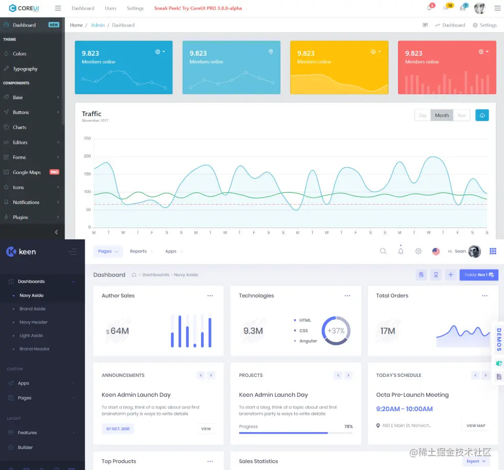
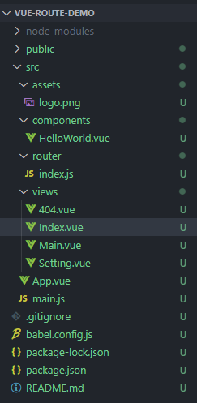
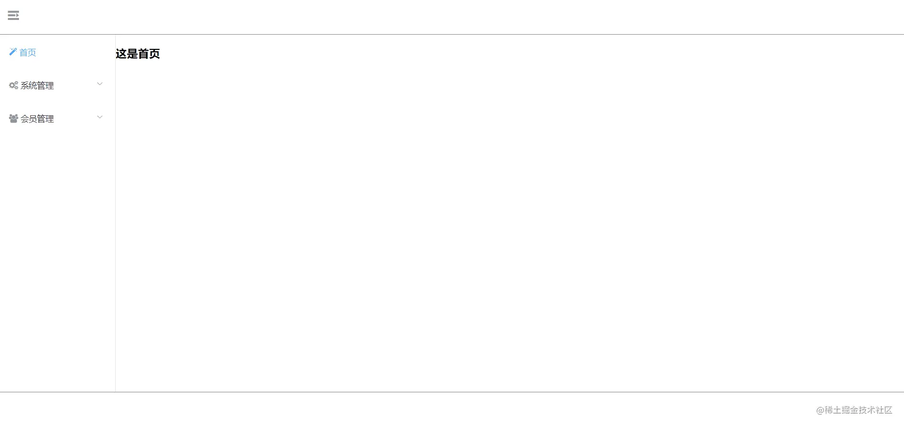

# 【项目实践】使用Vue.js和ElementUI快速实现后台管理系统的界面布局


## 前言

大家都知道，后台管理界面不需要很酷炫的动画效果，也不需要花里胡哨的界面布局，只需要简洁易用、清爽明了的界面以便于管理数据。而现在普遍的后台管理系统的界面布局都差不多，上中下结构，然后左边是导航栏。随便贴两个Bootstrap的主题模板就是这样的：




这其中难的不是布局，而是如何点击左侧导航栏来渲染中央显示界面（路由）。在这里我会用Vue.js和ElementUI来快速搭建起这样的后台管理界面布局！


## 准备

本文搭建项目时的工具以及版本号如下：

```
node.js 		v14.21.1
npm 			8.13.2
@vue/cli		4.5.19
element-ui		2.15.12
font-awesome	4.7.0
```

> ERROR  Failed to compile with 1 error
>
> 解决方法：()
>
> ```
> npm i node-sass@4.12.0 --save-dev
> npm i sass-loader@8.0.2 --save-dev
> ```
> 上面方法 node-sass 安装会报错，可尝试第二种：
>
> ```
> npm i sass@1.26.5 --save-dev
> npm i sass-loader@8.0.2 --save-dev
> ```

项目搭建好后，安装 `ElementUI` 和 `font-awesome`

```bash
npm install element-ui
npm install font-awesome
```

安装完毕后，在 `main.js` 中导入这两个工具：

```javascript
import Vue from 'vue'
import App from './App.vue'
import router from './router'

// 导入ElementUI
import ElementUI from 'element-ui';
import 'element-ui/lib/theme-chalk/index.css';
// 导入font-awesome(导入就可以直接用了)
import 'font-awesome/scss/font-awesome.scss'

// 使用ElementUI
Vue.use(ElementUI); 

Vue.config.productionTip = false

new Vue({
    router,
    render: h => h(App)
}).$mount('#app')
```


## 配置路由

首先修改整个项目的界面入口 `App.vue`

```vue
<template>
    <div id="app">
        <!--主路由视图-->
        <router-view/>
    </div>
</template>

<style lang="scss">
    // 整体布局样式，让整个视图都铺满
    html, body, #app {
        height: 100%;
        width: 100%;
        margin: 0;
        padding: 0;
    }
</style>
```

接下来，配置路由，先新建四个页面：`Main.vue`、`Index.vue`、`Setting.vue`、`404.vue`。其中 `Index.vue`和`Setting.vue`都是 `Main.vue`的嵌套路由，这里为了做演示，Index.vue和Setting.vue里面就只写一个简单的一级标题。此时我们的项目结构如下：



然后在 `router/index.js`文件中配置路由：

```javascript
import Vue from 'vue'
import VueRouter from 'vue-router'

Vue.use(VueRouter)

const routes = [
  {
    // 重定向，用来指向一打开网页就跳转的那个路由
    path: '/',
    redirect: '/main'
  },
  {
    // 首页
    path: '/main',
    name: 'Main',
    component: () => import('../views/Main.vue'),
    children: [ // 开始嵌套路由，这下面的所有路由都是Main路由的子路由
      {
        path: '/', //嵌套路由里默认打开的网页
        redirect: '/index'
      },
      {
        path: '/index', // 首页的路由
        name: 'Index',
        component: ()=> import('../views/Index.vue')
      },
      {
        path: '/setting', // 设置页面的路由
        name: 'Setting',
        component: ()=> import('../views/Setting.vue')
      }
    ]
  },
  {
    path: '/*', // 注意，这里不是嵌套路由了，这是为了设置404页面，一定要放在最后面，这样当服务器找不到页面的时候就会全部跳转到40
    name: '404',
    component: ()=> import('../views/404.vue')
  }
]

const router = new VueRouter({
  mode: 'history',
  base: process.env.BASE_URL,
  routes
})

export default router
```


## 布局

在 `Main.vue`页面设置最基本的结构，即上中下，中间又分左右：

```vue
<template>
    <el-container>
        <!--顶部-->
        <el-header></el-header>

        <!--中央区域-->
        <el-main>
            <el-container>
                <!--左侧导航栏-->
                <el-aside></el-aside>
                <!--主内容显示区域，数据内容都是在这里面渲染的-->
                <el-main></el-main>
            </el-container>
        </el-main>

        <!--底部-->
        <el-footer></el-footer>
    </el-container>
</template>
```


接下来只需要在对应的区域渲染好内容，这里最主要的就是使用 ElementUI 的路由功能，Main.vue 完整内容：

```vue
<template>
    <el-container>
        <!-- 顶部 -->
        <el-header class="header">
            <el-row class="header-icon">
                <el-col :span="1">
                    <!-- 收缩条 -->
                    <a href="#" @click="changeCollapse"> 
                        <i :class="collapseIcon"></i>
                    </a>
                </el-col>
            </el-row>
        </el-header>

        <!-- 中央区域 -->
        <el-main>
            <el-container>
                <!-- 左侧导航栏 -->
                <el-aside :style="{width:collapseWidth}">
                    <!-- 
                        default-active 代表导航栏默认选中哪个index，
                        :collapse 决定导航栏是否展开，为boolean类型
                        :router 决定导航栏是否开启路由模式，即在菜单上设置路由是否生效，为boolean类型
                     -->
                     <el-menu
                        default-active="0"
                        class="el-menu-vertical-demo"
                        :collapse="isCollapse"
                        :router="true">
                        <!-- index设置当前item的下标，:route则是传一个对象进行，指定路由 -->
                        <el-menu-item index="0" :route="{name:'Index'}">
                            <i class="fa fa-magic"></i>
                            <span slot="title">首页</span>
                        </el-menu-item>

                        <el-submenu index="1">
                            <template slot="title">
                                <i class="fa fa-cogs"></i><span>系统管理</span>
                            </template>

                            <el-menu-item index="/Setting" :route="{name:'Setting'}">
                                <i class="fa fa-cog"></i>
                                <span>网站设置</span>
                            </el-menu-item>

                            <el-menu-item index="1-2"><i class="fa fa-user-circle-o"></i> 角色管理</el-menu-item>
                            <el-menu-item index="1-2"><i class="fa fa-object-group"></i> 店铺模板</el-menu-item>
                        </el-submenu>

                        <el-submenu index="2">
                            <template slot="title">
                                <i class="fa fa-users"></i>
                                <span> 会员管理</span>
                            </template>

                            <el-menu-item index="2-1" :route="{name:'Customer'}"><i class="fa fa-address-card-o"></i>
                                会员列表
                            </el-menu-item>
                            <el-menu-item index="2-2"><i class="fa fa-envelope-o"></i> 会员通知</el-menu-item>
                        </el-submenu>
                    </el-menu>
                </el-aside>
                <!-- 主内容显示区域，数据内容都是再这里渲染的 -->
                <el-main>
                    <!-- 路由渲染 -->
                    <router-view></router-view>
                </el-main>
            </el-container>
        </el-main>

        <!-- 底部 -->
        <el-footer class="footer"></el-footer>
    </el-container>
</template>

<script>
export default {
    name: 'Main',
    data: function() {
        return {
            isCollapse: false, //决定左侧导航栏是否展开
        }
    },
    computed: {
        collapseIcon: function(){ //左侧导航栏是否展开状态的图标
            // 如果是展开状态，图标向右，否则图标向左
            return this.isCollapse ? 'el-icon-s-fold' : 'el-icon-s-unfold'
        },
        collapseWidth: function(){ //左侧导航栏是否展开状态的宽度
            return this.isCollapse ? '65px' : '200px'
        }
    },
    methods: {
        changeCollapse: function(){ // 更改左侧导航栏展示状态
            this.isCollapse = !this.isCollapse
        }
    }
}
</script>

<style scoped>
/* 整体显示区域布局样式 */
.el-container{
    height: 100%;
}
.el-header, .el-main {
    padding: 0;
}

/* header */
.header{
    border-bottom: 1px solid gray;
}
.header-icon{
    margin: 10px 15px;
}

.header-icon a{
    font-size: 25px;
    color: #909399;
}

/* 左侧导航栏样式 */
.el-menu-vertical-demo.el-menu{
    padding-left: 20px;
    text-align: left;
    height: 100%;
    padding: 0;
}

.footer{
    border-top: 1px solid gray;
}
</style>
```


Index.vue内容：

```vue
<template>
    <h2>首页</h2>
</template>
<script>
export default {
    name: 'Index'
}
</script>
```

Setting.vue内容：

```vue
<template>
    <h2>设置页面</h2>
</template>
<script>
export default {
    name: 'Setting'
}
</script>
```

404.vue内容：

```vue
<template>
    <h2>404 Not Found!</h2>
</template>
<script>
export default {
    name: '404'
}
</script>
```




