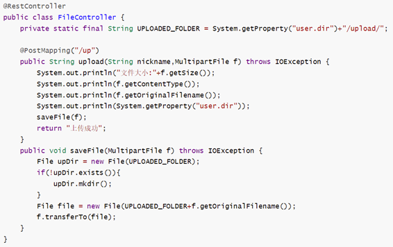
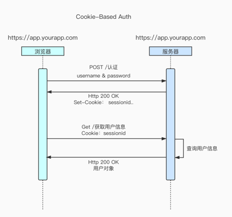
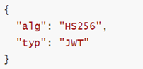
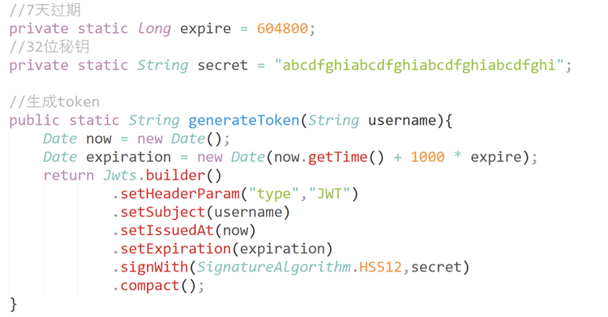

# 1天搞定 SpringBoot + Vue 全栈开发

> 视频：https://www.bilibili.com/video/BV1nV4y1s7ZN


> 开发环境：
>
> 开发工具： IDEA+VSCode
>
> 后端：SpringBoot(2.7.2)+MybatisPlus
>
> 前端：Vue+VueRouter+Vuex+ElementUI
>
> 接口调试：Swagger
>
> 数据模拟：MockJS
>
> 身份认证：JWT
>
> 后台管理：vue-admin-template
>
> 项目管理：阿里云ECS+Nginx+MySQL


> 参考：[nginx反向代理实现前后端分离 - 一缕清风丶 - 博客园 (cnblogs.com)](https://www.cnblogs.com/1234cjq/p/11206139.html)
>
> 资料：
>
> [代码_免费高速下载|百度网盘-分享无限制 (baidu.com)](https://pan.baidu.com/s/14KNks4WP5OUe1S-EiCdwhQ?pwd=93if&_at_=1675067749967#list/path=%2F&parentPath=%2F视频录制%2F企业云端开发实践)
>
> 正确姿势开发vue后台管理系统
>
> [正确姿势开发vue后台管理系统 - 掘金 (juejin.cn)](https://juejin.cn/post/6844903928761417741)


## 1. 课程介绍及环境准备

> 课程内容：
>
> 内容介绍
>
> 课程目标
>
> Web应用概述
>
> 开发环境配置


### 内容介绍

本课程是涵盖主流前后端开发技术的全栈课程，主要内容如下：

+ Java EE企业级框架：SpringBoot+MyBatisPlus
+ Web前端核心框架 ：Vue+ElementUI
+ 公共云部署：前后端项目集成打包与部署


### 课程目标

+ 掌握JavaEE企业级开发框架的使用，能够利用SpringBoot开发Web应用
+ 掌握Web前端开发框架Vue的使用，能够完成前后端分离开发。
+ 掌握云端环境的配置与使用，能够完成前后端程序的打包部署。


### Web应用概述

目前市面上的软件主要可分为两种：

+ BS:(Browser/Server,浏览器/服务器架构模式)。

+ CS:(Client/Server,客户端/服务器架构模式)。


**架构对比**

+ C/S架构主要特点是交互性强，具有安全访问模式，网络流量低，相应速度快，因为客户端负责大多数业务逻辑和UI演示，所以也被称为胖客户端，C/S结构的软件需要针对不同的操作系统开发不同版本的软件。
+ 随着互联网的兴起，C/S架构不适合Web，最大的原因是Web应用程序的修改和升级非常迅速，而C/S架构需要每个客户端逐个升级桌面App，因此，Browser/Server模式开始流行，简称B/S架构。
+ B/S架构的主要特点是分散性高、维护方便、开发简单、共享性高，总拥有成本低。


**BS架构原理**

在BS架构下，客户端只需要浏览器，应用程序的逻辑和数据都存储在服务器端。浏览器只需要请求服务器，获取Web页面，并把Web页面展示给用户即可。


### 开发环境配置

**Java环境配置**

1. 下载JDK安装包：https://www.oracle.com/java/technologies/downloads/#java8-windows

2. 双击下载好的JDK，按照提示进行默认安装即可，注意安装路径不能出现中文或空格。
3. 打开“高级系统设置”中的“环境变量”选项。
4. 新建“JAVA_HOME”环境变量，变量值为JDK的安装目录。
5. 将“JAVA_HOME”环境变量添加到Path中。

**IDEA开发工具**

使用 jetbrains idea 集成开发工具

**Maven** 

+ Maven是一个项目管理工具，可以对Java项目进行自动化的构建和依赖管理

**Maven的作用**

+ 项目构建：提供标准的，跨平台的自动化构建项目的方式

+ 依赖管理：方便快捷的管理项目依赖的资源(jar包)，避免资源间的版本冲突等问题
+ 统一开发结构：提供标准的，统一的项目开发结构，如下图所示：


**Maven 环境配置**

官方下载地址：http://maven.apache.org/download.cgi

将压缩包直接到任意目录（注意不要使用中文路径）


**Maven 仓库**

运行 Maven 的时候，Maven 所需要的任何构件都是直接从本地仓库获取的。如果本地仓库没有，它会首先尝试从远程仓库下载构件至本地仓库。


**本地仓库配置**

修改maven安装包中的conf/settings.xml文件，指定本地仓库位置。

```xml
<localRepository>D:\maven-repository</localRepository>
```


**远程仓库配置**

nmaven默认连接的远程仓库位置并不在国内，因此有时候下载速度非常慢，我们可以配置一个国内站点镜像，可用于加速下载资源。

```
<mirrors>
	<mirror>
		<id>aliyunmaven</id>
		<mirrorOf>*</mirrorOf>
		<name>阿里云公共仓库</name>
		<url>https://maven.aliyun.com/repository/public</url>
	<mirror>
</mirrors>
```


**与IDEA集成**


## 2. SpringBoot 快速上手

> 课程内容:
>
> SpringBoot介绍
>
> 快速创建SpringBoot应用
>
> 开发环境热部署
>
> 系统配置


### 2.1 SpringBoot 介绍

+ Spring Boot是由Pivotal团队提供的基于Spring的全新框架，旨在简化Spring应用的初始搭建和开发过程。

+ Spring Boot是所有基于Spring开发项目的起点。

+ Spring Boot就是尽可能地简化应用开发的门槛，让应用开发、测试、部署变得更加简单。


**SpringBoot特点**

+ 遵循“约定优于配置”的原则，只需要很少的配置或使用默认的配置
+ 能够使用内嵌的Tomcat、Jetty服务器，不需要部署war文件
+ 提供定制化的启动器：Starters，简化Maven配置，开箱即用
+ 纯Java配置，没有代码生成，也不需要XML配置
+ 提供了生产级的服务监控方案，如安全监控、应用监控、健康检测等。


### 2.2 快速创建SpringBoot应用

利用IDEA提供的Spring Initializr创建SpringBoot应用


HelloController.java

```java
package com.alex.helloworld;

import org.springframework.web.bind.annotation.GetMapping;
import org.springframework.web.bind.annotation.RestController;

/**
 * @author alex
 * @version 1.0
 * @description: TODO
 * @date 2023/2/4 15:41
 */
@RestController
public class HelloController {
    @GetMapping("/hello")
    public String Hello(){
        return "Hello,World!";
    }
}
```


### 2.3 开发环境热部署

+ 在实际的项目开发调试过程中会频繁地修改后台类文件，导致需要重新编译、重新启动，整个过程非常麻烦，影响开发效率。

+ Spring Boot提供了spring-boot-devtools组件，使得无须手动重启Spring Boot应用即可重新编译、启动项目，大大缩短编译启动的时间。

+ devtools会监听classpath下的文件变动，触发Restart类加载器重新加载该类，从而实现类文件和属性文件的热部署。

+ 并不是所有的更改都需要重启应用（如静态资源、视图模板），可以通过设置spring.devtools.restart.exclude属性来指定一些文件或目录的修改不用重启应用

**使用步骤**

+ 在pom.xml配置文件中添加dev-tools(spring-boot-devtools)依赖。

  ```xml
  <dependency>
      <groupId>org.springframework.boot</groupId>
      <artifactId>spring-boot-devtools</artifactId>
      <optional>true</optional>
  </dependency>
  ```

  使用 **optional=true** 表示依赖不会传递，即项目依赖devtools；其他项目如果引入此项目生成的jar包，则不会包含devtools

+ 在application.properties中配置dev-tools

  ```yaml
  # 热部署
  spring.devtools.restart.enabled=true
  # 设置重启目录
  spring.devtools.restart.additional-paths=src/main/java
  # 设置classpath目录下的 WEB-INF文件夹内容修改不重启
  spring.devtools.restart.exclude=static/**
  ```

+ 如果使用了Eclipse，那么在修改完代码并保存之后，项目将自动编译并触发重启，而如果使用了IntelliJ IDEA，还需要配置项目自动编译。

+ 打开Settings页面，在左边的菜单栏依次找到Build,Execution,Deployment→Compile，勾选Build project automatically

+ ~~按Ctrl+Shift+Alt+/快捷键调出Maintenance页面，单击Registry，勾选compiler.automake.allow.when.app.running复选框。~~

  这一步：Idea 2021版本不存在，是在 settings->Advanced Settings->Compiler下面，勾选

+ 做完这两步配置之后，若开发者再次在IntelliJ IDEA中修改代码，则项目会自动重启。


### 2.4 系统配置

+ 项目创建成功后会默认在resources目录下生成application.properties文件。该文件包含Spring Boot项目的全局配置。

+ 配置格式如下：

  ```yaml
  # 服务器端口配置
  server.port=8081
  ```

  

## 3. Web开发基础

> 教学内容
>
> + Web入门
> + 路由映射
> + 参数传递
> + 数据响应

### 3.1 Web入门

+ Spring Boot将传统Web开发的mvc、json、tomcat等框架整合，提供了spring-boot-starter-web组件，简化了Web应用配置。

+ 创建SpringBoot项目勾选Spring Web选项后，会自动将spring-boot-starter-web组件加入到项目中。

+ spring-boot-starter-web启动器主要包括web、webmvc、json、tomcat等基础依赖组件，作用是提供Web开发场景所需的所有底层依赖。

+ webmvc为Web开发的基础框架，json为JSON数据解析组件，tomcat为自带的容器依赖。 

```xml
<dependency>
    <groupId>org.springframework.boot</groupId>
    <artifactId>spring-boot-starter-web</artifactId>
</dependency>
```


**控制器**

+ Spring Boot提供了@Controller和@RestController两种注解来标识此类负责接收和处理HTTP请求。

+ 如果请求的是页面和数据，使用@Controller注解即可；如果只是请求数据，则可以使用@RestController注解。


**@Controller的用法**

示例中返回了hello页面和name的数据，在前端页面中可以通过${name}参数获取后台返回的数据并显示。

@Controller通常与Thymeleaf模板引擎结合使用。

```java
@Controller
public class HelloController{
    @RequestMapping("/hello")
    public String index(ModelMap map){
        map.addAttribute("name","zhangsan");
        return "hello";
    }
}
```


**@RestController的用法**

默认情况下，@RestController注解会将返回的对象数据转换为JSON格式。

```java
@RestController
public class HelloController{
    @RequestMapping("/user")
    public User getUser(ModelMap map){
        map.addAttribute("name","zhangsan");
        return "hello";
    }
}
```


### 3.2 路由映射

@RequestMapping注解主要负责URL的路由映射。它可以添加在Controller类或者具体的方法上。

如果添加在Controller类上，则这个Controller中的所有路由映射都将会加上此映射规则，如果添加在方法上，则只对当前方法生效。

@RequestMapping注解包含很多属性参数来定义HTTP的请求映射规则。常用的属性参数如下：

​	value: 请求URL的路径，支持URL模板、正则表达式

​	method: HTTP请求方法

​	consumes: 请求的媒体类型（Content-Type），如application/json

​	produces: 响应的媒体类型

​	params，headers: 请求的参数及请求头的值

@RequestMapping的value属性用于匹配URL映射，value支持简单表达式

   @RequestMapping("/user")

@RequestMapping支持使用通配符匹配URL，用于统一映射某些URL规则类似的请求：@RequestMapping("/getJson/*.json")，当在浏览器中请求/getJson/a.json或者/getJson/b.json时都会匹配到后台的Json方法

@RequestMapping的通配符匹配非常简单实用，支持“*”、“?”、“**”等通配符

符号“*”匹配任意字符，符号“**”匹配任意路径，符号“?”匹配单个字符。

有通配符的优先级低于没有通配符的，比如/user/add.json比/user/*.json优先匹配。

有“**”通配符的优先级低于有“*”通配符的。


**Method匹配**

HTTP请求Method有GET、POST、PUT、DELETE等方式。HTTP支持的全部Method

@RequestMapping注解提供了method参数指定请求的Method类型，包括RequestMethod.GET、RequestMethod.POST、RequestMethod.DELETE、RequestMethod.PUT等值，分别对应HTTP请求的Method

```java
@RequestMapping(value="/getData",method=RequestMethod.GET)
public String getData(){
    return "Hello";
}
```

Method匹配也可以使用@GetMapping、@PostMapping等注解代替。


**参数传递**

@RequestParam将请求参数绑定到控制器的方法参数上，接收的参数来自HTTP请求体或请求url的QueryString，当请求的参数名称与Controller的业务方法参数名称一致时,@RequestParam可以省略

@PathVaraible：用来处理动态的URL，URL的值可以作为控制器中处理方法的参数

@RequestBody接收的参数是来自requestBody中，即请求体。一般用于处理非 Content-Type: application/x-www-form-urlencoded编码格式的数据，比如：`application/json`、`application/xml`等类型的数据


## 4. Web开发进阶

SpringBoot文件上传+拦截器

> 课程内容：
>
> 静态资源访问
>
> 文件上传
>
> 拦截器


### 4.1 静态资源访问

使用IDEA创建Spring Boot项目，会默认创建出classpath:/static/目录，静态资源一般放在这个目录下即可。

如果默认的静态资源过滤策略不能满足开发需求，也可以自定义静态资源过滤策略。

默认如果在static目录下添加1.png，出现无法访问，**maven clean下**，再访问。

在application.properties中直接定义过滤规则和静态资源位置：

如果更改为：

```
# 更改静态资源默认访问路径
spring.mvc.static-path-pattern=/images/**
```

则访问images下1.png的路径为： http://localhost:8080/images/1.png


```yaml
spring.mvc.static-path-parttern=/static/**
spring.web.resources.static-locations=classpath:/static/
```

过滤规则为/static/**，静态资源位置为classpath:/static/

 

### 4.2 文件上传

表单的enctype 属性规定在发送到服务器之前应该如何对表单数据进行编码。

当表单的enctype="application/x-www-form-urlencoded"（默认）时，form表单中的数据格式为：key=value&key=value

当表单的enctype="multipart/form-data"时，其传输数据形式如下


**SpringBoot实现文件上传功能**

Spring Boot工程嵌入的tomcat限制了请求的文件大小，每个文件的配置最大为1Mb，单次请求的文件的总数不能大于10Mb。

要更改这个默认值需要在配置文件（如application.properties）中加入两个配置

```yaml
spring.servlet.multipart.max-file-size=10MB
spring.servlet.multipart.max-request-size=10MB
```

当表单的enctype="multipart/form-data"时,可以使用MultipartFile 获取上传的文件数据，再通过transferTo方法将其写入到磁盘中



演示的代码，路径更改为了tomcat运行的目录：

```java
package com.alex.helloworld.controller;

import org.springframework.web.bind.annotation.PostMapping;
import org.springframework.web.bind.annotation.RestController;
import org.springframework.web.multipart.MultipartFile;

import javax.servlet.http.HttpServletRequest;
import java.io.File;
import java.io.IOException;

/**
 * @author alex
 * @version 1.0
 * @description: TODO
 * @date 2023/2/4 17:03
 */
@RestController
public class FileController {
    private static final String UPLOAD_FOLDER = System.getProperty("user.dir")+"/upload/";

    // 前端请求参数要为form-data,
    @PostMapping("/upload")
    public String upload(String nickname, MultipartFile f, HttpServletRequest request) throws IOException{
        // 获取文件大小
        System.out.println("文件大小："+f.getSize());
        // 获取文件类型
        System.out.println(f.getContentType());
        // 获取图片原始名称
        System.out.println(f.getOriginalFilename());
        System.out.println(System.getProperty("user.dir"));
        // 下面在调试的时候没有固定路径；tomcat运行的路径
        String path = request.getServletContext().getRealPath("/upload/");
        System.out.println("tomcat运行路径:"+path);
        saveFile(path,f);
        return "上传成功";
    }

    private void saveFile(String path,MultipartFile f) throws IOException {
        File upDir = new File(path);
        if(!upDir.exists()){
            upDir.mkdirs();
        }
        File file = new File(path+f.getOriginalFilename());
        f.transferTo(file);
    }
}
```

如果想要访问刚才上传的文件，需要在application.properties中配置静态资源路径：

```properties
# 更改静态资源默认访问路径
spring.web.resources.static-locations=/upload/
```


### 4.3 拦截器

+ 拦截器在Web系统中非常常见，对于某些全局统一的操作，我们可以把它提取到拦截器中实现。总结起来，拦截器大致有以下几种使用场景：

+ 权限检查：如登录检测，进入处理程序检测是否登录，如果没有，则直接返回登录页面。

+ 性能监控：有时系统在某段时间莫名其妙很慢，可以通过拦截器在进入处理程序之前记录开始时间，在处理完后记录结束时间，从而得到该请求的处理时间

+ 通用行为：读取cookie得到用户信息并将用户对象放入请求，从而方便后续流程使用，还有提取Locale、Theme信息等，只要是多个处理程序都需要的，即可使用拦截器实现。

+ Spring Boot定义了HandlerInterceptor接口来实现自定义拦截器的功能

+ HandlerInterceptor接口定义了 **preHandle、postHandle、afterCompletion** 三种方法，通过重写这三种方法实现请求前、请求后等操作


**拦截器定义**

```java
public class LoginInterceptor extends HandlerInterceptor {
    /**
     * 在请求处理之前进行调用(Controller方法调用之前)
     */
    @Override
    public boolean preHandler(HttpServletRequest request, HttpServletResponse reponse, Object handler){
        
    }
}
```

**拦截器注册**

+ addPathPatterns方法定义拦截的地址
+ excludePathPatterns定义排除某些地址不被拦截
+ 添加的一个拦截器没有addPathPattern任何一个url则默认拦截所有请求
+ 如果没有excludePathPatterns任何一个请求，则默认不放过任何一个请求。


## 5. 构建RESTful服务

> 课程内容：
>
> + RESTful介绍
> + 构建RESTful应用接口
> + 使用Swagger生成Web API文档

### 5.1 RESTful 介绍

RESTful是目前流行的互联网软件服务架构设计风格。

REST（Representational State Transfer，表述性状态转移）一词是由Roy Thomas Fielding在2000年的博士论文中提出的，它定义了互联网软件服务的架构原则，如果一个架构符合REST原则，则称之为RESTful架构。

REST并不是一个标准，它更像一组客户端和服务端交互时的架构理念和设计原则，基于这种架构理念和设计原则的Web API更加简洁，更有层次。


**RESTful 的特点**

每一个URI代表一种资源

客户端使用GET、POST、PUT、DELETE四种表示操作方式的动词对服务端资源进行操作：GET用于获取资源，POST用于新建资源（也可以用于更新资源），PUT用于更新资源，DELETE用于删除资源。

通过操作资源的表现形式来实现服务端请求操作。

资源的表现形式是JSON或者HTML。

客户端与服务端之间的交互在请求之间是无状态的，从客户端到服务端的每个请求都包含必需的信息。


**RESTful API**

符合RESTful规范的Web API需要具备如下两个关键特性：

安全性：安全的方法被期望不会产生任何副作用，当我们使用GET操作获取资源时，不会引起资源本身的改变，也不会引起服务器状态的改变。

幂等性：幂等的方法保证了重复进行一个请求和一次请求的效果相同（并不是指响应总是相同的，而是指服务器上资源的状态从第一次请求后就不再改变了），在数学上幂等性是指N次变换和一次变换相同。


**HTTP Method**

HTTP提供了POST、GET、PUT、DELETE等操作类型对某个Web资源进行Create、Read、Update和Delete操作。

一个HTTP请求除了利用URI标志目标资源之外，还需要通过HTTP Method指定针对该资源的操作类型，一些常见的HTTP方法及其在RESTful风格下的使用：


**HTTP状态码**

HTTP状态码就是服务向用户返回的状态码和提示信息，客户端的每一次请求，服务都必须给出回应，回应包括HTTP状态码和数据两部分。

HTTP定义了40个标准状态码，可用于传达客户端请求的结果。状态码分为以下5个类别：

1xx：信息，通信传输协议级信息

2xx：成功，表示客户端的请求已成功接受

3xx：重定向，表示客户端必须执行一些其他操作才能完成其请求

4xx：客户端错误，此类错误状态码指向客户端

5xx：服务器错误，服务器负责这写错误状态码

RESTful API中使用HTTP状态码来表示请求执行结果的状态，适用于REST API设计的代码以及对应的HTTP方法。


### 5.2 构建RESTful应用接口

Spring Boot实现RESTful API


### 5.3 什么是Swagger

Swagger是一个规范和完整的框架，用于生成、描述、调用和可视化RESTful风格的Web服务，是非常流行的API表达工具。

Swagger能够自动生成完善的RESTful API文档，，同时并根据后台代码的修改同步更新，同时提供完整的测试页面来调试API。


**使用 Swagger生成Web API 文档**

在Spring Boot项目中集成Swagger同样非常简单，只需在项目中引入 **springfox-swagger2** 和 **springfox-swagger-ui** 依赖即可。

```xml
<dependency>
    <groupId>io.springfox</groupId>
    <artifactId>springfox-swagger2</artifactId>
    <version>2.9.2</version>
</dependency>

<dependency>
    <groupId>io.springfox</groupId>
    <artifactId>springfox-swagger-ui</artifactId>
    <version>2.9.2</version>
</dependency>
```


**配置Swagger**

```java
package com.alex.helloworld.config;

import org.springframework.context.annotation.Bean;
import org.springframework.context.annotation.Configuration;
import springfox.documentation.builders.ApiInfoBuilder;
import springfox.documentation.builders.PathSelectors;
import springfox.documentation.builders.RequestHandlerSelectors;
import springfox.documentation.service.ApiInfo;
import springfox.documentation.spi.DocumentationType;
import springfox.documentation.spring.web.plugins.Docket;
import springfox.documentation.swagger2.annotations.EnableSwagger2;

/**
 * @author alex
 * @version 1.0
 * @description: TODO
 * @date 2023/2/4 17:52
 */
@Configuration // 告诉Spring容器，这个类是一个配置类
@EnableSwagger2 // 启用Swagger2功能
public class Swagger2Config {
    /**
     * 配置Swagger2相关的bean *
     * @return
     */
    @Bean
    public Docket createRestApi(){
        return new Docket(DocumentationType.SWAGGER_2)
                .apiInfo(apiInfo())
                .select()
                .apis(RequestHandlerSelectors.basePackage("com")) // com包下所有API都交给Swagger2管理
                .paths(PathSelectors.any()).build();
    }

    // API文档页面显示信息
    private ApiInfo apiInfo() {
        return new ApiInfoBuilder()
                .title("演示项目API")
                .description("学习Swagger2的演示项目")
                .build();
    }
}

```


**注意事项**

报错处理：

```
2023-02-04 18:01:50.540 ERROR 14432 --- [  restartedMain] o.s.boot.SpringApplication               : Application run failed

org.springframework.context.ApplicationContextException: Failed to start bean 'documentationPluginsBootstrapper'; nested exception is java.lang.NullPointerException
```

原因：

Spring Boot 2.6.X后与Swagger有版本冲突问题，需要在application.properties中加入以下配置：

```yaml
spring.mvc.pathmatch.matching-strategy=ant_path_matcher
```


**使用 Swagger2 进行接口测试**

启动项目访问 http://127.0.0.1:8080/swagger-ui.html ，即可打开自动生成的可视化测试页面


**Swagger常用注解**

Swagger提供了一系列注解来描述接口信息，包括接口说明、请求方法、请求参数、返回信息等


**swagger2 在生产环境下关闭**

[Spring Boot 禁用 Swagger 的三种方式 - 掘金 (juejin.cn)](https://juejin.cn/post/7012779158849716261)

1. 在application.properties中定义: `spring.profiles.active=prod`
2. 在Swagger2Config上添加注解 `@Profile({“dev”,“test”})`


## 6. MybatisPlus快速上手

> **课程内容：**
>
> ORM介绍
>
> MyBatis-Plus介绍
>
> MyBatis-Plus CRUD 操作
>
> **知识目标：**
>
> 了解什么是持久化？
>
> 掌握ORM原理
>
> 掌握常用ORM框架
>
> 了解MyBatisPlus特性
>
> **技能目标：**
>
> 熟练配置 MyBatisPlus 运行环境，为后期编码打好基础

### 6.1 ORM介绍

ORM（Object Relational Mapping，对象关系映射）是为了解决面向对象与关系数据库存在的互不匹配现象的一种技术。

ORM通过使用描述对象和数据库之间映射的元数据将程序中的对象自动持久化到关系数据库中。

ORM框架的本质是简化编程中操作数据库的编码。


### 6.2 MyBatis-Plus介绍

MyBatis是一款优秀的数据持久层ORM框架，被广泛地应用于应用系统。

MyBatis能够非常灵活地实现动态SQL，可以使用XML或注解来配置和映射原生信息，能够轻松地将Java的POJO（Plain Ordinary Java Object，普通的Java对象）与数据库中的表和字段进行映射关联。

MyBatis-Plus是一个 MyBatis 的增强工具，在 MyBatis 的基础上做了增强，简化了开发。


### 6.3 MyBatis-Plus CRUD 操作

**添加依赖**

```xml
<!-- MyBatisPlus依赖 -->
<dependency>
    <groupId>com.baomidou</groupId>
    <artifactId>mybatis-plus-boot-starter</artifactId>
    <version>3.4.2</version>
</dependency>
<!-- mysql驱动依赖 -->
<dependency>
    <groupId>mysql</groupId>
    <artifactId>mysql-connector-java</artifactId>
    <version>5.1.47</version>
</dependency>
<!-- 数据连接池 druid -->
<dependency>
    <groupId>com.alibaba</groupId>
    <artifactId>druid-spring-boot-starter</artifactId>
    <version>1.1.20</version>
</dependency>
```

**全局配置**

+ 配置数据库相关信息

```properties
spring.datasource.type=com.alibaba.druid.pool.DruidDataSource
spring.datasource.driver-class-name=com.mysql.jdbc.Driver
spring.datasource.url=jdbc://localhost:3306/mydb?useSSL=false
spring.datasource.username=root
spring.datasource.password=root
mybatis-plus.configuration.log-impl=org.apache.ibatis.logging.stdout.StdOutImpl
```

+ 添加 @MapperScan 注解

```java
@SpringBootApplication
@MapperScan("com.alex.mpdemo.mapper")
public class MpdemoApplication {
    public static void main(String[] args) {
        SpringApplication.run(MpdemoApplication.class, args);
    }
}
```

**Mybatis CRUD注解**


**CRUD操作**


在调用 `/getUser`，获取所有用户时，控制台打印信息：

参考：[记一次事务报错问题 Transaction synchronization is not active - 陈海翔 - 博客园 (cnblogs.com)](https://www.cnblogs.com/muxuanchan/p/11357953.html)

```
Creating a new SqlSession
SqlSession [org.apache.ibatis.session.defaults.DefaultSqlSession@2bc4595b] was not registered for synchronization because synchronization is not active
JDBC Connection [com.mysql.jdbc.JDBC4Connection@19e52378] will not be managed by Spring
```

产生原因：没有配置事物控制

加上@Transactional后，

```java
/**
* 查询所有用户 *
* @return
*/
@Transactional(rollbackFor = Exception.class)
@Select("select * from user")
List<User> findAll();
```

打印的信息，

```
Registering transaction synchronization for SqlSession [org.apache.ibatis.session.defaults.DefaultSqlSession@4305c229]
JDBC Connection [com.mysql.jdbc.JDBC4Connection@581bed13] will be managed by Spring
```


**这个api，如果没有添加@RequestBody，则使用x-www-form-urlencoded提交，只有加了@RequestBody才能用json格式。**

```java
@PostMapping("/user")
public String save(@RequestBody User user){
    int i = userMapper.add(user);
    if(i>0){
        return "插入成功";
    }else{
        return "插入失败";
    }

}
```

@RequestBody主要用来接收前端传递给后端的json字符串中的数据的(请求体中的数据的)；而最常用的使用请求体传参的无疑是POST请求了，所以使用@RequestBody接收数据时，一般都用POST方式进行提交。在后端的同一个接收方法里，@RequestBody与@RequestParam()可以同时使用，@RequestBody最多只能有一个，而@RequestParam()可以有多个。

注：一个请求，只有一个RequestBody；一个请求，可以有多个RequestParam。


MyBatis的写法：

UserMapper代码：

```java
package com.alex.mpdemo.mapper;

import com.alex.mpdemo.entity.User;
import org.apache.ibatis.annotations.*;
import org.springframework.transaction.annotation.Transactional;

import java.util.List;

/**
 * @author alex
 * @version 1.0
 * @description: TODO
 * @date 2023/2/4 22:22
 */
@Mapper
public interface UserMapper {

    /**
     * 增加用户 *
     * @param user
     * @return
     */
    @Insert("insert into user values(#{id}, #{username}, #{password}, #{phone}, #{mail})")
    int add(User user);

    /**
     * 更新用户信息 *
     * @param user
     * @return
     */
    @Update("update user set username=#{username}, password=#{password}, phone=#{phone}, mail=#{mail} where id=#{id}")
    int update(User user);


    /**
     * 删除指定id的用户*
     * @param id
     * @return
     */
    @Delete("delete from user where id=#{id}")
    int deleteById(int id);

    /**
     * 根据id查询用户 *
     * @param id
     * @return
     */
    @Select("select * from user where id=#{id}")
    User findById(int id);

    /**
     * 查询所有用户 *
     * @return
     */
    @Transactional(rollbackFor = Exception.class)
    @Select("select * from user")
    List<User> findAll();
}
```


UserController代码：

```java
package com.alex.mpdemo.controller;

import com.alex.mpdemo.entity.User;
import com.alex.mpdemo.mapper.UserMapper;
import org.springframework.beans.factory.annotation.Autowired;
import org.springframework.web.bind.annotation.*;

import java.util.List;

/**
 * @author alex
 * @version 1.0
 * @description: TODO
 * @date 2023/2/4 18:32
 */
@RestController
public class UserController {

    @Autowired
    private UserMapper userMapper;

    @GetMapping("/user")
    public List<User> query(){
        List<User> userList =  userMapper.findAll();
        System.out.println(userList);
        return userList;
    }

    @GetMapping("/user/{id}")
    public User queryById(@PathVariable int id){
        User user = userMapper.findById(id);
        return user;
    }

    @PostMapping("/user")
    public String save(@RequestBody User user){
        int i = userMapper.add(user);
        if(i>0){
            return "插入成功";
        }else{
            return "插入失败";
        }

    }

    @DeleteMapping("/user")
    public String deleteByUserId(int id){
        int i = userMapper.deleteById(id);
        if(i>0){
            return "删除成功";
        }else{
            return "删除失败";
        }
    }

    @PutMapping("/user")
    public String update(User user){
        int i = userMapper.update(user);
        if(i>0){
            return "更新成功";
        }else{
            return "更新失败";
        }
    }
}
```


MyBatisPlus的写法：

```java
package com.alex.mpdemo.mapper;

import com.alex.mpdemo.entity.User;
import com.baomidou.mybatisplus.core.mapper.BaseMapper;
import org.apache.ibatis.annotations.*;
import org.springframework.transaction.annotation.Transactional;

import java.util.List;

/**
 * @author alex
 * @version 1.0
 * @description: TODO
 * @date 2023/2/4 22:22
 */
@Mapper
public interface UserMapper extends BaseMapper<User> {}
```

UserController.java写法：

```java
package com.alex.mpdemo.controller;

import com.alex.mpdemo.entity.User;
import com.alex.mpdemo.mapper.UserMapper;
import com.baomidou.mybatisplus.core.conditions.update.UpdateWrapper;
import org.springframework.beans.factory.annotation.Autowired;
import org.springframework.web.bind.annotation.*;

import java.util.List;

/**
 * @author alex
 * @version 1.0
 * @description: TODO
 * @date 2023/2/4 18:32
 */
@RestController
public class UserController {

    @Autowired
    private UserMapper userMapper;

    @GetMapping("/user")
    public List<User> query(){
        List<User> userList = userMapper.selectList(null);
        System.out.println(userList);
        return userList;
    }

    @GetMapping("/user/{id}")
    public User queryById(@PathVariable int id){
        User user = userMapper.selectById(id);
        return user;
    }

    @PostMapping("/user")
    public String save(@RequestBody User user){
        int i = userMapper.insert(user);
        if(i>0){
            return "插入成功";
        }else{
            return "插入失败";
        }

    }

    // delete localhost:8080/user?id=4
    @DeleteMapping("/user")
    public String deleteByUserId(@RequestBody int id){
        int i = userMapper.deleteById(id);
        if(i>0){
            return "删除成功";
        }else{
            return "删除失败";
        }
    }

    @PutMapping("/user")
    public String update(@RequestBody User user){
        UpdateWrapper<User> updateWrapper = new UpdateWrapper<>();
        updateWrapper.eq("id",user.getId());
        int i = userMapper.update(user,updateWrapper);
        if(i>0){
            return "更新成功";
        }else{
            return "更新失败";
        }
    }
}
```


报错：

```
Could not set property 'id' of 'class com.alex.mpdemo.entity.User' with value '1621892773605638145' Cause: java.lang.IllegalArgumentException: argument type mismatch] with
```

原因是：数据库主键`id` 设置为了自增长，需要在实体类中设置主键为自增长：

```
@TableId(value = "id",type = IdType.AUTO)
private Integer id;
```


**MyBatisPlus注解**

+ @TableName，当表名与实体类名称不一致时，可以使用@TableName注解进行关联。

+ @TableField，当表中字段名称与实体类属性不一致时，使用@TableField进行关联

+ @TableId，用于标记表中的主键字段，MybatisPlus也提供了主键生成策略。


## 7. MyBatisPlus 多表查询及分页查询

> 课程内容：
>
> 多表查询
>
> 分页查询

### 7.1 多表查询

实现复杂关系映射，可以使用@Results注解，@Result注解，@One注解，@Many注解组合完成复杂关系的配置。


查询订单报错：

```
### Error querying database.  Cause: com.mysql.jdbc.exceptions.jdbc4.MySQLSyntaxErrorException: You have an error in your SQL syntax; check the manual that corresponds to your MySQL server version for the right syntax to use near 'order where uid = 1' at line 1

```

原因: UserMapper.java 中 order与SQL关键字 order冲突

```java
public interface OrderMapper extends BaseMapper<Order> {

    @Select("select * from order where uid = #{uid}")
    List<Order> selectByUid(int uid);

    // 查询所有的订单，同时查询订单的用户
    @Select("select * from order")
    @Results({
            @Result(column = "id",property = "id"),
            @Result(column = "ordertime",property = "ordertime"),
            @Result(column = "total",property = "total"),
            @Result(column = "uid",property = "user", javaType = User.class,
                one=@One(select = "com.alex.mpdemo.mapper.UserMapper.selectById"))

    })
    List<Order> selectAllOrderAndUser();
}
```

更改为：

```java
@Select("select * from `order` where uid = #{uid}")

@Select("select * from `order`")
```


### 7.2 分页查询

编写配置文件


测试：


## 8. Vue框架快速上手

> 课程内容：
>
> 前端环境准备
>
> Vue框架介绍
>
> Vue快速入门

### 8.1 前端环境准备

+ 编码工具：VSCode

+ 依赖管理：NPM

+ 项目构建：VueCli


### 8.2 Vue框架介绍

**MVVM模式**

+ 基本用法
+ 内容渲染指令
+ 属性绑定指令
+ 使用JavaScript表达式
+ 事件绑定指令
+ 条件渲染指令
+ v-else和v-else-if指令
+ 列表渲染指令
+ v-for中的key


## 9. Vue组件开发

> 课程内容：
>
> NPM使用
>
> Vue Cli使用
>
> 组件化开发

### 9.1 NPM 使用

+ NPM（Node Package Manager）是一个NodeJS包管理和分发工具。

+ NPM以其优秀的依赖管理机制和庞大的用户群体，目前已经发展成为整个JS领域的依赖管理工具

+ NPM最常见的用法就是用于安装和更新依赖。要使用NPM，首先要安装Node工具。

**NodeJS安装**

+ Node.js 是一个基于 Chrome V8 引擎 的 JavaScript 运行时环境。

+ Node中包含了NPM包管理工具。

+ 下载地址：https://nodejs.org/zh-cn/


**npm使用**


### 9.2 Vue Cli 使用

+ Vue CLI是Vue官方提供的构建工具，通常称为脚手架。

+ 用于快速搭建一个带有热重载（在代码修改后不必刷新页面即可呈现修改后的效果）及构建生产版本等功能的单页面应用。

+ Vue CLI基于 webpack 构建，也可以通过项目内的配置文件进行配置。

+ 安装：npm install -g @vue/cli


### 9.3 组件化开发

组件（Component）是Vue.js最强大的功能之一。组件可以扩展HTML元素，封装可重用的代码。

Vue的组件系统允许我们使用小型、独立和通常可复用的组件构建大型应用。


**组件的构成**

+ Vue 中规定组件的后缀名是 .vue

+ 每个 .vue 组件都由 3 部分构成，分别是
  + template，组件的模板结构，可以包含HTML标签及其他的组件
  + script，组件的 JavaScript 代码
  + style，组件的样式


## 10. 第三方组件element-ui

> 课程内容：
>
> 组件间的传值
>
> element-ui介绍
>
> 组件的使用
>
> 图标的使用


### 10.1 组件间的传值

组件可以由内部的Data提供数据，也可以由父组件通过prop的方式传值。

兄弟组件之间可以通过Vuex等统一数据源提供数据共享。

### 10.2 element-ui介绍

Element是国内饿了么公司提供的一套开源前端框架，简洁优雅，提供了Vue、React、Angular等多个版本。

文档地址：https://element.eleme.cn/#/zh-CN/

安装：npm i element-ui

引入 Element：

```js
import Vue from 'vue'
import ElementUI from 'element-ui'
import 'element-ui/lib/theme-chalk/index.css'
import App from './App.vue'

Vue.use(ElementUI)

new Vue({
    el:'#app',
    render: h=>h(App)
})
```


### 10.3 组件的使用


### 10.4 图标的使用

由于Element UI提供的字体图符较少，一般会采用其他图表库，如著名的Font Awesome

Font Awesome提供了675个可缩放的矢量图标，可以使用CSS所提供的所有特性对它们进行更改，包括大小、颜色、阴影或者其他任何支持的效果。

文档地址：http://fontawesome.dashgame.com/

安装：npm install font-awesome

使用：import 'font-awesome/css/font-awesome.min.css'

示例：

```html
<i class="fa fa-camera-retro"></i> fa-camera-retro
```


## 11. Axios网络请求

> Axios的使用
>
> 与Vue整合
>
> 跨域

### 11.1 axios简介

在实际项目开发中，前端页面所需要的数据往往需要从服务器端获取，这必然涉及与服务器的通信。

Axios 是一个基于 promise 网络请求库，作用于node.js 和浏览器中。

Axios 在浏览器端使用XMLHttpRequests发送网络请求，并能自动完成JSON数据的转换 。

安装：npm install axios

地址：https://www.axios-http.cn/


**发送网络请求**

+ 发送GET请求
+ 发送POST请求
+ async/await
+ 其他请求方式


### 11.2 与Vue整合

在实际项目开发中，几乎每个组件中都会用到 axios 发起数据请求。此时会遇到如下两个问题：

每个组件中都需要导入 axios

每次发请求都需要填写完整的请求路径

可以通过全局配置的方式解决上述问题：

```javascript
// 配置请求根路径
axios.defaults.baseURL='http://api.com'

// (Vue3)将axios作为全局的自定义属性，每个组件可以在内部直接访问
app.config.globalProperties.$http=axios

// (Vue2)将axios作为全局的自定义属性，每个组件可以在内部直接访问
Vue.prototype.$http=axios
```

### 11.3 跨域

**为什么会出现跨域问题**

为了保证浏览器的安全，不同源的客户端脚本在没有明确授权的情况下，不能读写对方资源，称为同源策略，同源策略是浏览器安全的基石

同源策略（Sameoriginpolicy）是一种约定，它是浏览器最核心也最基本的安全功能

所谓同源（即指在同一个域）就是两个页面具有相同的协议（protocol），主机（host）和端口号（port）

当一个请求url的协议、域名、端口三者之间任意一个与当前页面url不同即为跨域，此时无法读取非同源网页的 Cookie，无法向非同源地址发送 AJAX 请求


**跨域问题解决**

+ CORS(Cross-Origin Resource Sharing)是由W3C制定的一种跨域资源共享技术标准，其目的就是为了解决前端的跨域请求
+ CORS可以在不破坏既有规则的情况下，通过后端服务器实现CORS接口，从而实现跨域通信
+ CORS将请求分为两类：简单请求和非简单请求，分别对跨域通信提供了支持。


**简单请求**

满足以下条件的请求即为简单请求：

请求方法：GET、POST、HEAD

除了以下的请求头字段之外，没有自定义的请求头：

Accept、Accept-Language、Content-Language、Last-Event-ID、Content-Type

Content-Type的值只有以下三种：

text/plain、multipart/form-data、application/x-www-form-urlencoded


**简单请求的服务器处理**

对于简单请求，CORS的策略是请求时在请求头中增加一个Origin字段，


服务器收到请求后，根据该字段判断是否允许该请求访问，如果允许，则在HTTP头信息中添加Access-Control-Allow-Origin字段。


**非简单请求**

对于非简单请求的跨源请求，浏览器会在真实请求发出前增加一次OPTION请求，称为预检请求（preflight request）

预检请求将真实请求的信息，包括请求方法、自定义头字段、源信息添加到HTTP头信息字段中，询问服务器是否允许这样的操作。

例如一个GET请求：


Access-Control-Request-Method表示请求使用的HTTP方法，Access-Control-Request-Headers包含请求的自定义头字段

服务器收到请求时，需要分别对Origin、Access-Control-Request-Method、Access-Control-Request-Headers进行验证，验证通过后，会在返回HTTP头信息中添加：


Access-Control-Allow-Methods、Access-Control-Allow-Headers：真实请求允许的方法、允许使用的字段

Access-Control-Allow-Credentials: 是否允许用户发送、处理cookie

Access-Control-Max-Age: 预检请求的有效期，单位为秒，有效期内不会重复发送预检请求。

当预检请求通过后，浏览器才会发送真实请求到服务器。这样就实现了跨域资源的请求访问。


**SpringBoot中配置CORS**

在传统的Java EE开发中，可以通过过滤器统一配置，而Spring Boot中对此则提供了更加简洁的解决方案


## 12. 前端路由VueRouter

> 课程内容：
>
> VueRouter安装与使用
>
> 参数传递
>
> 子路由
>
> 导航守卫


### 12.1 VueRouter安装与使用

Vue路由vue-router是官方的路由插件，能够轻松的管理 SPA 项目中组件的切换。

Vue的单页面应用是基于路由和组件的，路由用于设定访问路径，并将路径和组件映射起来

vue-router 目前有 3.x 的版本和 4.x 的版本，vue-router 3.x 只能结合 vue2 进行使用，vue-router 4.x 只能结合 vue3 进行使用

安装：npm install vue-router@4


### 12.2 参数传递


### 12.3 子路由


### 12.4 导航守卫

vue-router提供的导航守卫主要用来拦截导航，让它完成跳转或取消。

to：Route：即将要进入的目标路由。

from：Route：当前导航正要离开的路由。

next：在守卫方法中如果声明了next形参，则必须调用 next() 函数，否则不允许用户访问任何一个路由

直接放行：next()，强制其跳转到登录页面：next('/login')


## 13. 状态管理 Vuex

> 课程内容
>
> Vuex介绍
>
> Vuex安装与使用

### 13.1 Vue介绍

对于组件化开发来说，大型应用的状态往往跨越多个组件。在多层嵌套的父子组件之间传递状态已经十分麻烦，而Vue更是没有为兄弟组件提供直接共享数据的办法。

基于这个问题，许多框架提供了解决方案——使用全局的状态管理器，将所有分散的共享数据交由状态管理器保管，Vue也不例外。

Vuex 是一个专为 Vue.js 应用程序开发的状态管理库，采用集中式存储管理应用的所有组件的状态。

简单的说，Vuex用于管理分散在Vue各个组件中的数据。 

安装：npm install vuex@next


**状态管理**

每一个Vuex应用的核心都是一个store，与普通的全局对象不同的是，基于Vue数据与视图绑定的特点，当store中的状态发生变化时，与之绑定的视图也会被重新渲染。

store中的状态不允许被直接修改，改变store中的状态的唯一途径就是显式地提交（commit）mutation，这可以让我们方便地跟踪每一个状态的变化。

在大型复杂应用中，如果无法有效地跟踪到状态的变化，将会对理解和维护代码带来极大的困扰。

Vuex中有5个重要的概念：State、Getter、Mutation、Action、Module。


+ State
  + State用于维护所有应用层的状态，并确保应用只有唯一的数据源
  + 在组件种，可以直接使用 this.$store.state.count访问数据，也可以先用mapState辅助函数将其映射下来

+ Getter
  + Getter维护由State派生的一些状态，这些状态随着State状态的变化而变化
  + 在组件中，可以直接使用this.$store.getters.doneTodos，也可以先用mapGetters辅助函数将其映射下来，代码如下：

+ Mutation

  + Mutation提供修改State状态的方法。
  + 在组件中，可以直接使用store.commit来提交mutation
  + 也可以先用mapMutation辅助函数将其映射下来

+ Action

  + Action类似Mutation，不同在于:

    Action不能直接修改状态，只能通过提交mutation来修改，Action可以包含异步操作

  + 在组件中，可以直接使用this.$store.dispatch('xxx')分发 action，或者使用mapActions辅助函数先将其映射下来

+ Module

  + 由于使用单一状态树，当项目的状态非常多时，store对象就会变得十分臃肿。因此，Vuex允许我们将store分割成模块（Module）
  + 每个模块拥有独立的State、Getter、Mutation和Action，模块之中还可以嵌套模块，每一级都有着相同的结构。


**总结**

作为一个状态管理器，首先要有保管状态的容器——State；

为了满足衍生数据和数据链的需求，从而有了Getter；

为了可以“显式地”修改状态，所以需要Mutation；

为了可以“异步地”修改状态（满足AJAX等异步数据交互），所以需要Action；

最后，如果应用有成百上千个状态，放在一起会显得十分庞杂，所以分模块管理（Module）也是必不可少的；

Vuex并不是Vue应用开发的必选项，在使用时，应先考虑项目的规模和特点，有选择地进行取舍，对于小型应用来说，完全没有必要引入状态管理，因为这会带来更多的开发成本；


## 14. 前端数据模拟 mockjS

> mockjs介绍
>
> mockjs基本使用
>
> 数据生成规则

### 14.1 mockjs介绍

+ Mock.js 是一款前端开发中拦截Ajax请求再生成随机数据响应的工具，可以用来模拟服务器响应。
+ 优点是非常简单方便，无侵入性，基本覆盖常用的接口数据类型。
+ 支持生成随机的文本、数字、布尔值、日期、邮箱、链接、图片、颜色等。
+ 安装：npm install mockjs

### 14.2 mockjs基本使用

在项目中创建mock目录，新建index.js文件


**基本使用**

组件中调用mock.js中模拟的数据接口，这时返回的response就是mock.js中用Mock.mock(‘url’,data）中设置的data

```javascript
import axios from 'axios'
export default {
    mounted: function(){
        axios.get('/product/search').then(res=>{
            console.log(res)
        })
    }
}
```

**核心方法**

Mock.mock( rurl?, rtype?, template|function( options ) )

+ rurl，表示需要拦截的 URL，可以是 URL 字符串或 URL 正则

+ rtype，表示需要拦截的 Ajax 请求类型。例如 GET、POST、PUT、DELETE 等。

+ template，表示数据模板，可以是对象或字符串

+ function，表示用于生成响应数据的函数。


### 14.3 数据生成规则

mock的语法规范包含两层规范: 数据模板 （DTD）、数据占位符 （DPD）

数据模板中的每个属性由 3 部分构成：属性名name、生成规则rule、属性值value：

```
'name|rule':value
```


属性名和生成规则之间用竖线 | 分隔，生成规则是可选的，有 7 种格式：


## 15. vue-element-admin 后台集成方案

> vue-element-admin介绍
>
> 安装与使用
>
> 源码解读


### 15.1 vue-element-admin介绍

vue-element-admin 是一个后台前端解决方案，它基于 vue 和 element-ui实现。

内置了 i18 国际化解决方案，动态路由，权限验证，提炼了典型的业务模型，提供了丰富的功能组件。

可以快速搭建企业级中后台产品原型。

地址：https://panjiachen.github.io/vue-element-admin-site/zh/guide/


### 15.2 安装与使用

克隆项目，git clone https://github.com/PanJiaChen/vue-element-admin.git

进入项目目录，cd vue-element-admin

安装依赖，npm install

使用淘宝镜像，npm install --registry=https://registry.npm.taobao.org

 本地开发 启动项目，npm run dev

**注意事项**

若依赖安装不成功，很大概率是node-sass安装失败。

node-sass因为其历史原因，安装时极易失败，同时node-sass依赖了Python环境，因此电脑上需要安装配置Python2。

建议直接使用课程提供的包含有依赖包的项目，简化学习曲线。

**项目构建过程**

项目提供了完成的构建过程，适合前端技术的学习：https://juejin.cn/post/6844903476661583880

本课程对其内部的核心流程进行分析。

### 15.3 源码解读


```javascript
handleLogin(){

}
```


## 16. 跨域认证

> 课程内容：
>
> Session认证
>
> Token认证
>
> JWT的使用

跨域 Cookie 可以共享


### 16.1 Session认证

互联网服务离不开用户认证。一般流程是下面这样。

+ 用户向服务器发送用户名和密码。

+ 服务器验证通过后，在当前对话（session）里面保存相关数据，比如用户角色、登录时间等。

+ 服务器向用户返回一个 session_id，写入用户的 Cookie。

+ 用户随后的每一次请求，都会通过 Cookie，将 session_id 传回服务器。

+ 服务器收到 session_id，找到前期保存的数据，由此得知用户的身份。

**Session认证流程**



**Session认证**

session 认证的方式应用非常普遍，但也存在一些问题，扩展性不好，如果是服务器集群，或者是跨域的服务导向架构，就要求 session 数据共享，每台服务器都能够读取 session，针对此种问题一般有两种方案：

+ 一种解决方案是session 数据持久化，写入数据库或别的持久层。各种服务收到请求后，都向持久层请求数据。这种方案的优点是架构清晰，缺点是工程量比较大。

+ 一种方案是服务器不再保存 session 数据，所有数据都保存在客户端，每次请求都发回服务器。Token认证就是这种方案的一个代表。


### 16.2 Token认证

Token 是在服务端产生的一串字符串,是客户端访问资源接口（API）时所需要的资源凭证，流程如下：

- 客户端使用用户名跟密码请求登录，服务端收到请求，去验证用户名与密码
- 验证成功后，服务端会签发一个 token 并把这个 token 发送给客户端
- 客户端收到 token 以后，会把它存储起来，比如放在 cookie 里或者 localStorage 里
- 客户端每次向服务端请求资源的时候需要带着服务端签发的 token
- 服务端收到请求，然后去验证客户端请求里面带着的 token ，如果验证成功，就向客户端返回请求的数据 

**Token认证流程**


**Token认证的特点**

基于 token 的用户认证是一种服务端无状态的认证方式，服务端不用存放 token 数据。

用解析 token 的计算时间换取 session 的存储空间，从而减轻服务器的压力，减少频繁的查询数据库

token 完全由应用管理，所以它可以避开同源策略 


### 16.3 JWT使用

JSON Web Token（简称 JWT）是一个token的具体实现方式，是目前最流行的跨域认证解决方案。

JWT 的原理是，服务器认证以后，生成一个 JSON 对象，发回给用户，具体如下：


用户与服务端通信的时候，都要发回这个 JSON 对象。服务器完全只靠这个对象认定用户身份。

为了防止用户篡改数据，服务器在生成这个对象的时候，会加上签名。

JWT 的由三个部分组成，依次如下：

- Header（头部）
- Payload（负载）
- Signature（签名）

三部分最终组合为完整的字符串，中间使用 . 分隔，如下：

Header.Payload.Signature


**Header**

Header 部分是一个 JSON 对象，描述 JWT 的元数据



alg属性表示签名的算法（algorithm），默认是 HMAC SHA256（写成 HS256）

typ属性表示这个令牌（token）的类型（type），JWT 令牌统一写为JWT

最后，将上面的 JSON 对象使用 Base64URL 算法转成字符串。

**Payload**

Payload 部分也是一个 JSON 对象，用来存放实际需要传递的数据。JWT 规定了7个官方字段，供选用。


注意，JWT 默认是不加密的，任何人都可以读到，所以不要把秘密信息放在这个部分。

这个 JSON 对象也要使用 Base64URL 算法转成字符串。

**Signature**

Signature 部分是对前两部分的签名，防止数据篡改。

首先，需要指定一个密钥（secret）。这个密钥只有服务器才知道，不能泄露给用户

然后，使用 Header 里面指定的签名算法（默认是 HMAC SHA256），按照下面的公式产生签名。


**JWT**

算出签名以后，把 Header、Payload、Signature 三个部分拼成一个字符串，每个部分之间用"点"（`.`）分隔，就可以返回给用户。


**JWT特点**

客户端收到服务器返回的 JWT，可以储存在 Cookie 里面，也可以储存在 localStorage。

客户端每次与服务器通信，都要带上这个 JWT，可以把它放在 Cookie 里面自动发送，但是这样不能跨域。

更好的做法是放在 HTTP 请求的头信息`Authorization`字段里面，单独发送。

**JWT的实现**

1. 加入依赖

```xml
<dependency>
	<groupId>io.jsonwebtoken</groupId>
    <artifactId>jjwt</artifactId>
    <version>0.9.1</version>
</dependency>
```

2. 生成token



3. 解析token


## 17. 综合应用

> 后台讲解

SpringBoot+vue-element-template


## 18. 阿里云服务器使用

> 云服务器介绍
>
> 阿里云ECS的使用
>
> 云服务器远程连接

ECS的最重要特点是弹性，支持垂直和水平扩展两种能力。

垂直扩展：可以在几分钟内升级CPU和内存，实时升级带宽；

水平扩展：可以在几分钟内，创建数百个新的实例，完成任务后，可以立刻销毁这些实例。


## 19. SpringBoot+Vue云端环境配置

> 安装MySql
>
> 安装nginx
>
> 安装JDK

### 一、云端环境准备

以下部署基于CentOS7系统环境

1.1 安装 MySQL

卸载CentOS7自带的 mariadb

```bash
# 查找
rpm -qa | grep mariadb
# mariadb-libs-5.5.52-1.el7.x86_64
# 卸载
rpm -e mariadb-libs-5.5.52-1.el7.x86_64 --nodeps
```

解压 mysql

```bash
# 创建mysql安装包存放点
mkdir /usr/server/mysql
# 解压
mysql-5.7.34-1.el7.x86_64.rpm-bundle.tar
```

执行安装

```bash
# 切换到安装目录
cd /usr/server/mysql/
yum -y install libaio
yum -y install libncurses*
yum -y install perl perl-devel
# 安装
rpm -ivh mysql-community-common-5.7.34-1.el7.x86_64.rpm
rpm -ivh mysql-community-libs-5.7.34-1.el7.x86_64.rpm
rpm -ivh mysql-community-client-5.7.34-1.el7.x86_64.rpm
rpm -ivh mysql-community-server-5.7.34-1.el7.x86_64.rpm
```

启动 MySQL

```bash
#启动mysql
systemctl start mysqld.service
#查看生成的临时root密码
cat /var/log/mysqld.log | grep password
```


## 20. SpringBoot+Vue项目云端部署

