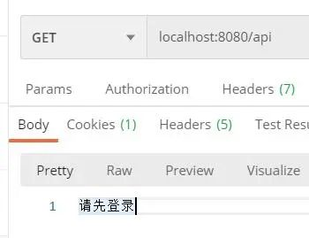
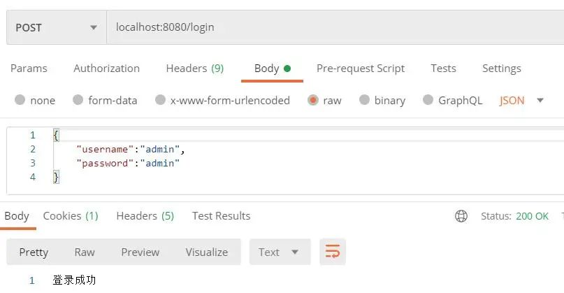
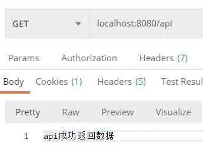

# 【项目实践】在用安全框架前，我想先让你手撸一个登陆认证

> 参考：http://mp.weixin.qq.com/s?__biz=MzkzMjE3NTA3Mg==&mid=2247484720&idx=1&sn=28e0f9ca266016b542a985d7f07dab6d&chksm=c25e88bff52901a91a693ce9f64954a38951a23614e23e633106943d16fc71f39fd7b0f22e16&scene=21#wechat_redirect
>
> 源码：alex-java/project-pratice/login-demo
>
> Content type 'multipart/form-data;boundary=XXX' not supported:
>
>  https://blog.csdn.net/DazedMen/article/details/102519462


# 前言

登录认证，估计是所有系统中最常见的功能了，并且也是最基础、最重要的功能。为了做好这一块而诞生了许多安全框架，比如最常见的Shiro、Spring Security等。

本文是一个系列文章，最终的目的是想与大家分享在实际项目中如何运用安全框架完成登录认证（**「Authentication」**）、权限授权（**「Authorization」**）等功能。只不过一上来就讲框架的配置和使用我觉得并不好，一是对于新手来说会很懵逼，二是不利于大家对框架的深入理解。所以本文先写 手撸登录认证基本功能，下一篇文章再写 不用安全框架手撸权限授权，最后再写 如何运用安全框架整合这些功能。

本文会从最简单、最基础的讲解起，新手可放心食用。读完文章你能收获：

- 登录认证的原理
- 如何使用`Session`和`JWT`分别完成登录认证功能
- 如何使用过滤器和拦截器分别完成对登录认证的统一处理
- 如何实现上下文对象

文章结尾放上了github地址，本文所有代码都放在上面了，克隆下来即可运行查看效果。


# 基础知识

登录认证（Authentication）的概念非常简单，就是通过一定手段对用户的身份进行确认。

确认这还不容易？就是判断用户的账号和密码是否正确嘛，if、else搞定。没错，这的确很容易，但是确认过后呢？要知道在web系统中有一个重要的概念就是：**「HTTP请求是一个无状态的协议」**。就是说浏览器每一次发送的请求都是独立的，对于服务器来说你每次的请求都是“新客”，它不记得你曾经有没有来过。举一个例子大家就知道了：

A：你早上吃的啥？

B：小笼包。

A：味道咋样啊？

B：哈？啥味道咋样？！

**「无状态，也可以叫作无记忆」**，服务器不会记得你之前做了什么，它只会看到你当前的请求。所以，在Web系统中确认了用户的身份后，还需要有种机制来记住这个用户已经登录过了，不然用户每一次操作都要输入账号密码，那这系统也没法用了！

那怎样才能让服务器记住你的登录状态呢？那就是凭证！登录之后每一次请求都携带一个登录凭证来告诉服务器我是谁，这样才能有以下的效果：

A：你早上吃的啥？

B：小笼包。

A：**「你早上吃的小笼包」**味道咋样啊？

B：味道不错。

现在流行两种方式登录认证方式：**「Session」**和**「JWT」**，无论是哪种方式其原理都是Token机制，即保存凭证：

1. 前端发起登录认证请求
2. 后端登录验证通过，返回给前端一个**「凭证」**
3. 前端发起新的请求时携带**「凭证」**

接下来我们就上代码，用这两种方式分别实现登录认证功能

# 实现

我们使用SpringBoot来搭建Web项目，只需导入Web项目依赖：

```xml
<dependency>
    <groupId>org.springframework.boot</groupId>
    <artifactId>spring-boot-starter-web</artifactId>
</dependency>
```

我们再建一个实体类用来模拟用户：

```java
public class User{
    private String username;
    private String password;
}
```

## Session

Session，是一种有状态的会话管理机制，其目的就是为了解决HTTP无状态请求带来的问题。

当用户登录认证请求通过时，服务端会将用户的信息存储起来，并生成一个`Session Id`发送给前端，前端将这个`Session Id`保存起来（一般是保存在Cookie中）。之后前端再发送请求时都携带`Session Id`，服务器端再根据这个`Session Id`来检查该用户有没有登录过：


### 基本功能

接下来我们就用代码来实现具体功能，非常简单，我们只需要在用户登录的时候将用户信息存在`HttpSession`中就完成了：

```java
@RestController
public class SessionController {
    
    @PostMapping("login")
    public String login(@RequestBody User user, HttpSession session) {
        // 判断账号密码是否正确，这一步肯定是要读取数据库中的数据来进行校验的，这里为了模拟就省去了
        if ("admin".equals(user.getUsername()) && "admin".equals(user.getPassword())) {
            // 正确的话就将用户信息存到session中
            session.setAttribute("user", user);
            return "登录成功";
        }
   
        return "账号或密码错误";
    }
    
    @GetMapping("/logout")
    public String logout(HttpSession session) {
        // 退出登录就是将用户信息删除
        session.removeAttribute("user");
        return "退出成功";
    }
    
}
```

在后续会话中，用户访问其他接口就可以检查用户是否已经登录认证：

```java
@GetMapping("api")
public String api(HttpSession session) {
    // 模拟各种api，访问之前都要检查有没有登录，没有登录就提示用户登录
    User user = (User) session.getAttribute("user");
    if (user == null) {
        return "请先登录";
    }
    // 如果有登录就调用业务层执行业务逻辑，然后返回数据
    return "成功返回数据";
}

@GetMapping("api2")
public String api2(HttpSession session) {
    // 模拟各种api，访问之前都要检查有没有登录，没有登录就提示用户登录
    User user = (User) session.getAttribute("user");
    if (user == null) {
        return "请先登录";
    }
    // 如果有登录就调用业务层执行业务逻辑，然后返回数据
    return "成功返回数据";
}
```

我们现在来测试一下效果，先不登录调用一下其他接口看看：



可以看到是调用失败的，那我们再进行登录：



登录成功后我们再调用刚才的接口：



这样就完成了基本的登录功能！是不是相当简单？

之前说过保持登录的核心就是凭证，可上面的代码也没看到传递凭证的过程呀，这是因为这些工作Servlet都帮我们做好了！

如果用户第一次访问某个服务器时，服务器响应数据时会在响应头的`Set-Cookie`标识里将`Session Id`返回给浏览器，浏览器就将标识中的数据存在`Cookie`中：


浏览器后续访问服务器就会携带Cookie：


每一个`Session Id`都对应一个`HttpSession`对象，然后服务器就根据你这个`HttpSession`对象来检测你这个客户端是否已经登录了，也就是刚才代码里演示的那样。

> 有人可能会问，前后端分离一般都是用`ajax`跨域请求后端数据，怎么携带cookie呢。这个很简单，只需要`ajax`请求时设置 `withCredentials=true`就可以跨域携带 cookie信息了

### 过滤器

完成了基本的登录认证后我们再加强一下功能！除了登录接口外，我们其他接口都要在Controller层里做登录判断，这太麻烦了。我们完全可以对每个接口过滤拦截一下，判断有没有登录，如果没有登录就直接结束请求，登录了才放行。这里我们通过过滤器来实现：

```
@Component
public class LoginFilter extends OncePerRequestFilter {
    @Override
    protected void doFilterInternal(HttpServletRequest request, HttpServletResponse response, FilterChain filterChain) throws ServletException, IOException {
        // 简单的白名单，登录这个接口直接放行
        if ("/login".equals(request.getRequestURI())) {
            filterChain.doFilter(request, response);
            return;
        }

        // 已登录就放行
        User user = (User) request.getSession().getAttribute("user");
        if (user != null) {
            filterChain.doFilter(request, response);
            return;
        }

        // 走到这里就代表是其他接口，且没有登录
        // 设置响应数据类型为json（前后端分离）
        response.setContentType("application/json;charset=utf-8");
        PrintWriter out = response.getWriter();
        // 设置响应内容，结束请求
        out.write("请先登录");
        out.flush();
        out.close();
    }
}
```

这时我们Controller层就可以去除多余的登录判断逻辑了：

```java
@GetMapping("api")
public String api() {
    return "api成功返回数据";
}

@GetMapping("api2")
public String api2() {
    return "api2成功返回数据";
}
```

重启服务后我们再调用一下登录接口看下效果：


过滤器生效了！

### 上下文对象

在有些情况下，就算加了过滤器后我们现在还不能在controller层将session代码去掉！因为在实际业务中对用户对象操作是非常常见的，而我们的业务代码一般都写在Service业务层，那么我们Service层想要操作用户对象还得从Controller那传参过来，就像这样：

```java
@GetMapping("api")
public String api(HttpSession session) {
    User user = (User) session.getAttribute("user");
    // 将用户对象传递给Service层
    userService.doSomething(user);
    return "成功返回数据";
}
```

每个接口都要这么写太麻烦了，有没有什么办法可以让我直接在Service层获取到用户对象呢？当然是可以的，我们可以通过SpringMVC提供的`RequestContextHolder`对象在程序任何地方获取到当前请求对象，从而获取我们保存在`HttpSession`中的用户对象。我们可以写一个上下文对象来实现该功能：

```java
public class RequestContext {
    public static HttpServletRequest getCurrentRequest() {
        // 通过`RequestContextHolder`获取当前request请求对象
        return ((ServletRequestAttributes) (RequestContextHolder.currentRequestAttributes())).getRequest();
    }

    public static User getCurrentUser() {
        // 通过request对象获取session对象，再获取当前用户对象
        return (User)getCurrentRequest().getSession().getAttribute("user");
    }
}
```

然后我们在Service层直接调用我们写的方法就可以获取到用户对象啦：

```java
public void doSomething() {
    User user = RequestContext.getCurrentUser();
    System.out.println("service层---当前登录用户对象：" + user);
}
```

我们再在Controller层直接调用Service：

```java
@GetMapping("api")
public String api() {
    // 各种业务操作
    userService.doSomething();
    return "api成功返回数据";
}
```

这样一套做好之后，看下前端成功调用`api`接口时的效果：


Service层成功获取上下文对象！

## JWT

除了`Session`之外，目前比较流行的做法就是使用`JWT`（JSON Web Token）。关于`JWT`网上有很多讲解资料，一个工具而已会用就行，所以在这里我就不过多解释这玩意了，大家只需要知道这两点就行：

1. 可以将一段数据加密成一段字符串，也可以从这字符串解密回数据
2. 可以对这个字符串进行校验，比如有没有过期，有没有被篡改

有上面两个特性之后就可以用来做登录认证了。当用户登录成功的时候，服务器生成一个`JWT`字符串返回给浏览器，浏览器将`JWT`保存起来，在之后的请求中都携带上`JWT`，服务器再对这个`JWT`进行**「校验」**，校验通过的话就代表这个用户登录了：


咦！这不和`Session`一样嘛，就是把`Session Id`换成了`JWT`字符串而已，这图啥啊。

没错，整体流程来说是一样的，我之前也说了，无论哪种方式其核心都是TOKEN机制。但，`Session`和`JWT`有一个重要的区别，就是**`Session`是有状态的，`JWT`是无状态的**。

说人话就是，`Session`在服务端**「保存了用户信息」**，而`JWT`在服务端**「没有保存任何信息」**。当前端携带`Session Id`到服务端时，服务端要检查其对应的`HttpSession`中有没有保存用户信息，保存了就代表登录了。当使用`JWT`时，服务端只需要对这个字符串进行校验，校验通过就代表登录了。

至于这两种方式各有什么好处和坏处先别着急讨论，咱先将`JWT`用起来！两者的优缺点文章最后会做讲解滴。

### 基本功能

要用到`JWT`先要导入一个依赖项：

```xml
<dependency>
    <groupId>io.jsonwebtoken</groupId>
    <artifactId>jjwt</artifactId>
    <version>0.9.1</version>
</dependency>
```

为了方便使用，我们先写一个`JWT`的工具类，工具类就提供两个方法一个生成一个解析 ：

```java
public final class JwtUtil {
    /**
     * 这个秘钥是防止JWT被篡改的关键，随便写什么都好，但决不能泄露
     */
    private final static String secretKey = "whatever";
    /**
     * 过期时间目前设置成2天，这个配置随业务需求而定
     */
    private final static Duration expiration = Duration.ofHours(2);

    /**
     * 生成JWT
     * @param userName 用户名
     * @return JWT
     */
    public static String generate(String userName) {
        // 过期时间
        Date expiryDate = new Date(System.currentTimeMillis() + expiration.toMillis());

        return Jwts.builder()
                .setSubject(userName) // 将userName放进JWT
                .setIssuedAt(new Date()) // 设置JWT签发时间
                .setExpiration(expiryDate)  // 设置过期时间
                .signWith(SignatureAlgorithm.HS512, secretKey) // 设置加密算法和秘钥
                .compact();
    }

    /**
     * 解析JWT
     * @param token JWT字符串
     * @return 解析成功返回Claims对象，解析失败返回null
     */
    public static Claims parse(String token) {
        // 如果是空字符串直接返回null
        if (StringUtils.isEmpty(token)) {
            return null;
        }
  
        // 这个Claims对象包含了许多属性，比如签发时间、过期时间以及存放的数据等
        Claims claims = null;
        // 解析失败了会抛出异常，所以我们要捕捉一下。token过期、token非法都会导致解析失败
        try {
            claims = Jwts.parser()
                    .setSigningKey(secretKey) // 设置秘钥
                    .parseClaimsJws(token)
                    .getBody();
        } catch (JwtException e) {
            // 这里应该用日志输出，为了演示方便就直接打印了
            System.err.println("解析失败！");
        }
        return claims;
    }
```

工具类做好之后我们可以开始写登录接口了，和之前大同小异：

```java
@RestController
public class JwtController {
     @PostMapping("/login")
    public String login(@RequestBody User user) {
        // 判断账号密码是否正确，这一步肯定是要读取数据库中的数据来进行校验的，这里为了模拟就省去了
        if ("admin".equals(user.getUsername()) && "admin".equals(user.getPassword())) {
            // 如果正确的话就返回生成的token（注意哦，这里服务端是没有存储任何东西的）
            return JwtUtil.generate(user.getUsername());
        }
        return "账号密码错误";
    }
}
```

在后续会话中，用户访问其他接口时就可以校验`token`来判断其是否已经登录。前端将`token`一般会放在请求头的`Authorization`项传递过来，其格式一般为`类型 + token`。这个倒也不是一定得这么做，你放在自己自定义的请求头项也可以，只要和前端约定好就行。这里我们方便演示就将token直接放在`Authorization`项里了：

```java
@GetMapping("api")
public String api(HttpServletRequest request) {
    // 从请求头中获取token字符串
    String jwt = request.getHeader("Authorization");
    // 解析失败就提示用户登录
    if (JwtUtil.parse(jwt) == null) {
        return "请先登录";
    }
    // 解析成功就执行业务逻辑返回数据
    return "api成功返回数据";
}

@GetMapping("api2")
public String api2(HttpServletRequest request) {
    String jwt = request.getHeader("Authorization");
    if (JwtUtil.parse(jwt) == null) {
        return "请先登录";
    }
    return "api2成功返回数据";
}
```

接下来我们测试一下效果，先进行登录：


可以看到登录成功后服务器返回了`token`过来，然后我们将这个token设置到请求头中再调用其他接口看看效果：


可以看到成功返回数据了！我们再试一下不携带`token`和篡改`token`后调用其他接口会怎样：


可以看到，没有携带`token`或者私自篡改了`token`都会验证失败！

### 拦截器

和之前一样，如果每个接口都要手动判断一下用户有没有登录太麻烦了，所以我们做一个统一处理，这里我们换个花样用拦截器来做：

```
public class LoginInterceptor extends HandlerInterceptorAdapter {
    @Override
    public boolean preHandle(HttpServletRequest request, HttpServletResponse response, Object handler) throws Exception {
        // 简单的白名单，登录这个接口直接放行
        if ("/login".equals(request.getRequestURI())) {
            return true;
        }

        // 从请求头中获取token字符串并解析
        Claims claims = JwtUtil.parse(request.getHeader("Authorization"));
        // 已登录就直接放行
        if (claims != null) {
            return true;
        }

        // 走到这里就代表是其他接口，且没有登录
        // 设置响应数据类型为json（前后端分离）
        response.setContentType("application/json;charset=utf-8");
        PrintWriter out = response.getWriter();
        // 设置响应内容，结束请求
        out.write("请先登录");
        out.flush();
        out.close();
        return false;
    }
}
```

拦截器类写好之后，别忘了要使其生效，这里我们直接让`SpringBoot`启动类实现`WevMvcConfigurer`接口来做：

```
@SpringBootApplication
public class LoginJwtApplication implements WebMvcConfigurer {

    public static void main(String[] args) {
        SpringApplication.run(LoginJwtApplication.class, args);
    }

    @Override
    public void addInterceptors(InterceptorRegistry registry) {
        // 使拦截器生效
        registry.addInterceptor(new LoginInterceptor());
    }
}
```

这样就能省去接口中校验用户登录的逻辑了：

```
@GetMapping("api")
public String api() {
    return "api成功返回数据";
}

@GetMapping("api2")
public String api2() {
    return "api2成功返回数据";
}
```


可以看到，拦截器已经生效了！

### 上下文对象

统一拦截做好之后接下来就是我们的上下文对象，`JWT`不像`Session`把用户信息直接存储起来，所以`JWT`的上下文对象要靠我们自己来实现。

首先我们定义一个上下文类，这个类专门存储`JWT`解析出来的用户信息。我们要用到`ThreadLocal`，以防止线程冲突：

```
public final class UserContext {
    private static final ThreadLocal<String> user = new ThreadLocal<String>();

    public static void add(String userName) {
        user.set(userName);
    }

    public static void remove() {
        user.remove();
    }

    /**
     * @return 当前登录用户的用户名
     */
    public static String getCurrentUserName() {
        return user.get();
    }
}
```

这个类创建好之后我们还需要在拦截器里做下处理：

```
public class LoginInterceptor extends HandlerInterceptorAdapter {
    @Override
    public boolean preHandle(HttpServletRequest request, HttpServletResponse response, Object handler) throws Exception {
        ...省略之前写的代码

        // 从请求头中获取token字符串并解析
        Claims claims = JwtUtil.parse(request.getHeader("Authorization"));
        // 已登录就直接放行
        if (claims != null) {
            // 将我们之前放到token中的userName存到上下文对象中
            UserContext.add(claims.getSubject());
            return true;
        }

        ...省略之前写的代码
    }

    @Override
    public void afterCompletion(HttpServletRequest request, HttpServletResponse response, Object handler, Exception ex) throws Exception {
        // 请求结束后要从上下文对象删除数据，如果不删除则可能会导致内存泄露
        UserContext.remove();
        super.afterCompletion(request, response, handler, ex);
    }
}
```

这样一个上下文对象就做好了，用法和之前一样，可以在程序的其他地方直接获取到数据，我们在Service层中来使用它：

```
public void doSomething() {
    String currentUserName = UserContext.getCurrentUserName();
    System.out.println("Service层---当前用户登录名：" + currentUserName);
}
```

然后Controller层调用Service层：

```
@GetMapping("api")
public String api() {
    userService.doSomething();
    return "api成功返回数据";
}
```

这样一套做好之后，看下前端成功调用`api`接口时的效果：


控制台成功打印了！

# 补充

代码到此就完成了！就像开头所说，本文只是讲解了基本的登录认证功能实现，还有很多很多细节没有提及，比如密码加密、防XSS/CSRF攻击等。接下来我要补充的也不是这些细节，而是补充一些其他的基础知识，帮助大家更好的理解本文讲解的内容！

## 注意事项

本文为了方便演示省略了很多非登录认证核心的相关代码，比如在统一处理中如果发现用户没有登录应该是直接抛出自定义异常，然后由异常全局处理返回给前端统一的数据响应体，而不是像我们现在代码中一样直接用`PrintWriter`输出流输出数据。关于这方面可以参考我之前写的博客进行改造：【项目实践】SpringBoot三招组合拳，手把手教你打出优雅的后端接口

再有就是`JWT`的相关注意点。通过代码看到生成一个`JWT`字符串很简单，谁都可以生成。然后字符串这东西也谁都可以篡改，我们怎么保证这个字符串就是我们系统签发出去的呢？又怎么保证我们签发出去的字符串有没有被篡改呢？其中关键点就是工具类里写的`secretKey`属性了，`JWT`根据这个秘钥会生成一个独特的字符串，别人没有这个秘钥的话是无法伪造或篡改`JWT`的！**「所以这个秘钥是重中之重，在实际开发中一定要谨防泄露」**：开发环境下设置一个秘钥，生产环境设置一个秘钥，这个生产环境下的秘钥还要严防死守，可以通过配置中心来配置并且要防止开发人员在代码中打印出秘钥！

我们代码中演示的`JWT`是只存放了用户名，实际开发中你想存什么就存什么，不过**「一定不要存敏感信息」**（比如密码）！因为`JWT`只能防止被篡改，不能防止别人解密你这个字符串！

## Session和JWT的优劣

两种方式都可以实现登录认证，那么在实际开发中到底用哪一种估计是大家比较关心的问题！在这里我就简单说明一下两者各自的优劣，至于具体选型就根据自己实际业务需求来了。

首先说一下两者的优点吧：

Session：

- 开箱即用，简单方便
- 能够有效管理用户登录的状态：续期、销毁等（续期就是延长用户登录状态的时间，销毁就是清楚用户登录状态，比如退出登录）

JWT：

- 可直接解析出数据，服务端无需存储数据
- 天然地易于水平扩展（ABC三个系统，我同一个Token都可以登录认证，非常简单就完成了单点登录）

再说一下缺点：

Session：

- 较`JWT`而言，需要额外存储数据

JWT：

- `JWT`签名的长度远比一个 `Session Id`长很多，增加额外网络开销
- 无法销毁、续期登录状态
- 秘钥或`Token`一旦泄露，攻击者便可以肆无忌惮操作我们的系统

其实上面说的这些优缺点都可以通过一些手段来解决，就看自己取舍了！比如`Session`就不易于水平扩展吗？当然不是，无论是`Session`同步机制还是集中管理都可以非常好的解决。再比如`JWT`就真的无法销毁吗？当然也不是，其实可以将`Token`也在后端存储起来让其变成有状态的，就可以做到状态管理了！

**「软件开发没有银弹，技术选型根据自己业务需求来就好，千万不要单一崇拜某一技术而排斥其他同类技术！」**

# 收尾

OK，文章到这就要结束了！本文重点不是具体的代码，而是登录认证的基本原理！原理搞懂了，不管什么方式都是大同小异。