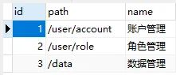
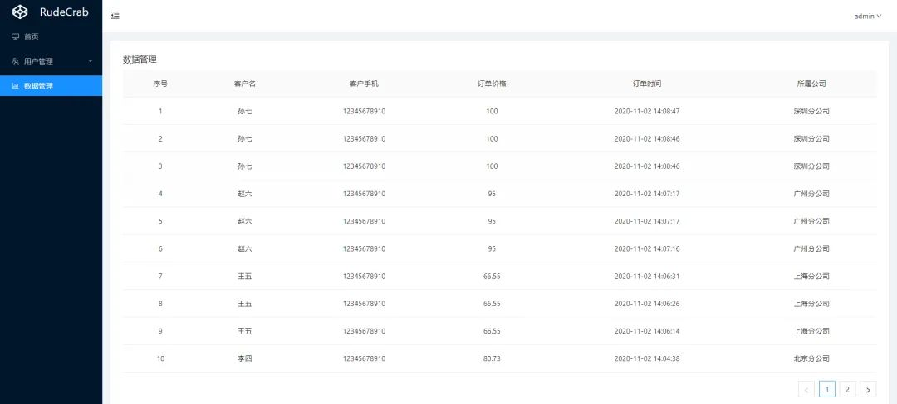

# 【项目实践】一文带你搞定页面权限、按钮权限以及数据权限

> 参考：
>
> [【项目实践】一文带你搞定页面权限、按钮权限以及数据权限 (qq.com)](https://mp.weixin.qq.com/s/cFQRTK18ED9X4HEgmiJswQ)
>
> [SpringBoot之HandlerInterceptorAdapter - Anlai_Wei - 博客园 (cnblogs.com)](https://www.cnblogs.com/weianlai/p/11358768.html)
>
> [SpringBoot 过滤器、监听器、拦截器、AOP 比较_命里良人的博客-CSDN博客](https://blog.csdn.net/qq_38566465/article/details/119457933)


# 前言

权限这一概念可以说是随处可见：等级不够进入不了某个论坛版块、对别人发的文章我只能点赞评论但不能删除或修改、朋友圈一些我看得了一些看不了，一些能看七天内的动态一些能看到所有动态等等等等。

每个系统的权限功能都不尽相同，各有其自身的业务特点，对权限管理的设计也都各有特色。不过不管是怎样的权限设计，大致可归为三种：**「页面权限(菜单级)、操作权限（按钮级）、数据权限」**，按维度划分的话就是：**「粗颗粒权限、细颗粒权限」**。

本文的重点是权限，为了方便演示我会省略非权限相关的代码，比如登录认证、密码加密等等。如果对于登录认证（**「Authentication」**）相关知识不太清楚的话，可以先看我上一篇写的[【项目实践】在用安全框架前，我想先让你手撸一个登陆认证](http://mp.weixin.qq.com/s?__biz=MzkzMjE3NTA3Mg==&mid=2247484720&idx=1&sn=28e0f9ca266016b542a985d7f07dab6d&chksm=c25e88bff52901a91a693ce9f64954a38951a23614e23e633106943d16fc71f39fd7b0f22e16&scene=21#wechat_redirect)。和上篇一样，本文的目的是带大家了解权限授权（**「Authorization」**）的核心，所以直接带你手撸权限授权，不会用上安全框架。核心搞清楚后，什么安全框架理解使用起来都会非常容易。

我会从最简单、最基础的讲解起，由浅入深、一步一步带大家实现各个功能。读完文章你能收获：

- 权限授权的核心概念
- 页面权限、操作权限、数据权限的设计与实现
- 权限模型的演进与使用
- 接口扫描与`SQL`拦截

文末贴上了Github地址，本文所有代码、`SQL`语句都放在了上面，克隆下来即可运行，**「不止有后端接口，前端页面也是有的哦！」**

# 基础知识

登录认证（Authentication）是对**「用户的身份」**进行确认，权限授权（Authorization）是对**「用户能否问某个资源」**进行确认。比如你输入账号密码登录到某个论坛，这就是认证。你这个账号是管理员所以想进哪个板块就进哪个板块，这就是授权。权限授权通常发生在登录认证成功之后，即先得确认你是谁，然后再确认你能访问什么。再举个例子大家就清楚了：

系统：你谁啊？

用户：我张三啊，这是我账号密码你看看

系统：哎哟，账号密码没错，看来是法外狂徒张三！你要干嘛呀（登录认证）

张三：我想进金库看看哇

系统：滚犊子，你只能进看守所，其他地方哪也去不了（权限授权）

可以看到权限的概念一点都不难，它就像是一个防火墙，保护资源不受侵害（没错，平常我们总说的网络防火墙也是权限的一种体现，不得不说网络防火墙这名字起得真贴切）。现在其实已经说清楚权限的本质是什么了，就是**「保护资源」**。无论是怎样的功能要求，权限其核心都是围绕在**「资源」**二字上。不能访问论坛版块，此时版块是资源；不能进入某些区域，此时区域是资源……

**「进行权限系统的设计，第一步就是考虑要保护什么资源，再接着思考如何保护这个资源」**。这句话是本文的重点，接下来我会详细地诠释这句话！

# 实现

我们使用`SpringBoot`搭建Web项目，`MySQL`和`Mybatis-plus`来进行数据存储与操作。下面是我们要用的必备依赖包：

```java
<dependencies>
    <!--web依赖包, web应用必备-->
    <dependency>
        <groupId>org.springframework.boot</groupId>
        <artifactId>spring-boot-starter-web</artifactId>
    </dependency>
    <!--MySQL，连接MySQL必备-->
    <dependency>
        <groupId>mysql</groupId>
        <artifactId>mysql-connector-java</artifactId>
        <scope>runtime</scope>
    </dependency>
    <!--MyBatis-plus，ORM框架，访问并操作数据库-->
    <dependency>
        <groupId>com.baomidou</groupId>
        <artifactId>mybatis-plus-boot-starter</artifactId>
        <version>3.4.0</version>
    </dependency>
</dependencies>
```

在设计权限相关的表之前，肯定是先得有一个最基础的用户表，字段很简单就三个，主键、用户名、密码：


对应的实体类和SQL建表语句我就不写了，大家一看表结构都知道该咋写（github上我放了完整的SQL建表文件）。

接下来我们就先实现一种非常简单的权限控制！

## 页面权限

页面权限非常容易理解，就是有这个权限的用户才能访问这个页面，没这个权限的用户就无法访问，它是以整个页面为维度，对权限的控制并没有那么细，所以是一种**「粗颗粒权限」**。

最直观的一个例子就是，有权限的用户就会显示所有菜单，无权限的用户就只会显示部分菜单：


这些菜单都对应着一个页面，控制了导航菜单就相当于控制住了页面入口，所以页面权限通常也可称为**「菜单权限」**。

### 权限核心

就像之前所说，要设计一个权限系统第一步就是要考虑 保护什么资源，页面权限这种要保护的资源那必然是页面嘛。一个页面（菜单）对应一个`URI`地址，当用户登录的时候判断这个用户拥有哪些页面权限，自然而然就知道要渲染出什么导航菜单了！这些理清楚后表的设计自然浮现眼前：


这个资源表非常简单但目前足够用了，假设我们页面/菜单的`URI`映射如下：


我们要设置用户的权限话，只要将用户id和`URI`对应起来即可：


上面的数据就表明，`id`为`1`的用户拥有所有的权限，`id`为`2`的用户只拥有数据管理权限（首页我们就让所有用户都能进，毕竟一个用户你至少还是得让他能看到一些最基本的东西嘛）。至此，我们就完成了页面权限的数据库表设计！

数据干巴巴放在那毫无作用，所以接下来我们就要进行代码的编写来使用这些数据。代码实现分为后端和前端，在前后端没有分离的时候，逻辑的处理和页面的渲染都是在后端进行，所以整体的逻辑链路是这样的：


用户登录后访问页面，我们来编写一下页面接口：

```java
@Controller // 注意哦，这里不是@RestController，代表返回的都是页面视图
public class ViewController {
    @Autowired
    private ResourceService resourceService;
    
    @GetMapping("/")
    public String index(HttpServletRequest request) {
        // 菜单名映射字典。key为uri路径，value为菜单名称，方便视图根据uri路径渲染菜单名
        Map<String, String> menuMap = new HashMap<>();
        menuMap.put("/user/account", "用户管理");
        menuMap.put("/user/role", "权限管理");
        menuMap.put("/data", "数据管理");
        request.setAttribute("menuMap", menuMap);
        
        // 获取当前用户的所有页面权限，并将数据放到request对象中好让视图渲染
        Set<String> menus = resourceService.getCurrentUserMenus();
        request.setAttribute("menus", menus);
        return "index";
    }
}
```

index.html：

```html
<!--这个语法为thymeleaf语法，和JSP一样是一种后端模板引擎技术-->
<ul>
    <!--首页让所有人都能看到，就直接渲染-->
    <li>首页</li>
    
    <!--根据权限数据渲染对应的菜单-->
    <li th:each="i : ${menus}">
        [[${menuMap.get(i)}]]
    </li>
    
</ul>
```

> 这里只是大概演示一下是如何渲染的，就不写代码的全貌了，重点是思路，不用过多纠结代码的细节

前后端未分离的模式下，至此页面权限的基本功能已经完成了。

那现在前后端分离模式下，后端只负责提供`JSON`数据，页面渲染是前端的事，此时整体的逻辑链路就发生了变化：


那么用户登录成功的同时，后端要将用户的权限数据返回给前端，这是我们登录接口：

```java
@RestController // 注意，这里是@RestController，代表该类所有接口返回的都是JSON数据
public class LoginController {
    @Autowired
    private UserService userService;

    @PostMapping("/login")
    public Set<String> login(@RequestBody UserParam user) {
        // 这里简单点就只返回一个权限路径集合
        return userService.login(user);
    }
}
```

具体的业务方法：

```java
@Service
public class UserServiceImpl implements UserService {
    @Autowired
    private ResourceMapper resourceMapper;
    @Autowired
    private UserMapper userMapper;

    @Override
    public Set<String> login(UserParam userParam) {
        // 根据前端传递过来的账号密码从数据库中查询用户数据
        // 该方法SQL语句：select * from user where user_name = #{userName} and password = #{password}
        User user = userMapper.selectByLogin(userParam.getUsername(), userParam.getPassword());
        if (user == null) {
            throw new ApiException("账号或密码错误");
        }
        
        // 返回该用户的权限路径集合
        // 该方法的SQL语句：select path from resource where user_id = #{userId}
        return resourceMapper.getPathsByUserId(user.getId());
    }
}
```

后端的接口咱们就编写完毕了，前端在登录成功后会收到后端传递过来的`JSON`数据：

```json
[
    "/user/account",
    "/user/role",
    "/data"
]
```

这时候后端不需要像之前那样将菜单名映射也传递给前端，**「前端自己会存储一个映射字典」**。前端将这个权限存储在本地（比如`LocalStorage`），然后根据权限数据渲染菜单，前后端分离模式下的权限功能就这样完成了。我们来看一下效果：


到目前为止，页面权限的基本逻辑链路就介绍完毕了，是不是非常简单？基本的逻辑弄清楚之后，剩下的不过就是非常普通的增删改查：当我想要让一个用户的权限变大时就对这个用户的权限数据进行增加，想让一个用户的权限变小时就对这个用户的权限数据进行删除……接下来我们就完成这一步，让系统的用户能够对权限进行管理，否则干什么都要直接操作数据库那肯定是不行的。

首先，肯定是得先让用户能够看到一个数据列表然后才能进行操作，我新增了一些数据来方便展示效果：


这里分页、新增账户、删除账户的代码怎么写我就不讲解了，就讲一下对权限进行编辑的接口：

```java
@RestController
public class LoginController {
    @Autowired
    private ResourceService resourceService;
    
    @PutMapping("/menus")
    private String updateMenus(@RequestBody UserMenusParam param) {
        resourceService.updateMenus(param);
        return "操作成功";
    }
}
```

接受前端传递过来的参数非常简单，就一个用户id和将要设置的菜单路径集合：

```java
// 省去getter、setter
public class UserMenusParam {
    private Long id;
    private Set<String> menus;
}
```

业务类的代码如下：

```java
@Override
public void updateMenus(UserMenusParam param) {
    // 先根据用户id删除原有的该用户权限数据
    resourceMapper.removeByUserId(param.getId());
    // 如果权限集合为空就代表删除所有权限，不用走后面新增流程了
    if (Collections.isEmpty(param.getMenus())) {
        return;
    }
    // 根据用户id新增权限数据
    resourceMapper.insertMenusByUserId(param.getId(), param.getMenus());
}
```

删除权限数据和新增权限数据的SQL语句如下：

```xml
<mapper namespace="com.rudecrab.rbac.mapper.ResourceMapper">
    <!--根据用户id删除该用户所有权限-->
    <delete id="deleteByUserId">
        delete from resource where user_id = #{userId}
    </delete>
    
    <!--根据用户id增加菜单权限-->
    <insert id="insertMenusByUserId">
        insert into resource(user_id, path) values
        <foreach collection="menus" separator="," item="menu">
            (#{userId}, #{menu})
        </foreach>
    </insert>
</mapper>
```

如此就完成了权限数据编辑的功能：


可以看到`root`用户之前是只能访问`数据管理`，对其进行权限编辑后，他就也能访问`账户管理`了，现在我们的页面权限管理功能才算完成。

是不是感觉非常简单，我们仅仅用了两张表就完成了一个权限管理功能。

### ACL模型

两张表十分方便且容易理解，系统小数据量小这样玩没啥，如果数据量大就有其弊端所在：

1. 数据重复极大

2. - 消耗存储资源。比如`/user/account`，我有多少用户有这权限我就得存储多少个这样的字符串。要知道这还是最简单的资源信息呢，只有一个路径，有些资源的信息可有很多哟：资源名称、类型、等级、介绍等等等等
   - 更改资源成本过大。比如`/data`我要改成`/info`，那现有的那些权限数据都要跟着改

3. 设计不合理

4. - 无法直观描述资源。刚才我们只弄了三个资源，如果我系统中想添加第四、五...种资源是没有办法的，因为现在的资源都是依赖于用户而存在，根本不能独立存储起来
   - 表的释义不清。现在我们的`resource`表与其说是在描述资源，倒不如说是在描述用户和资源的关系。

为了解决上述问题，我们应当对当前表设计进行改良，要将**「资源」**和**「用户和资源的关系」**拎清。用户和资源的关系是多对多的，一个用户可以有多个权限，一个权限下可以有多个用户，我们一般都用中间表来描述这种多对多关系。然后资源表就不用来描述关系了，只用来描述资源。 这样我们新的表设计就出来了：建立中间表，改进资源表！

我们先来对资源表进行改造，`id`、`user_id`、`path`这是之前的三个字段，`user_id`并不是用来描述资源的，所以我们将它删除。然后我们再额外加一个`name`字段用来描述资源名称（非必须），改造后此时资源表如下：


表里的内容就专门用来放资源：



资源表搞定了咱们建立一个中间表用来描述用户和权限的关系，中间表很简单就只存用户id和资源id：


之前的权限关系在中间表里就是这样存储的了：


现在的数据表明，id为`1`的用户拥有id为`1、2、3`的权限，即用户1拥有`账户管理、角色管理、数据管理`权限。id为`2`的用户只拥有id为`3`的资源权限，即用户2拥有`数据管理`权限！

整个表设计就如此升级完毕了，现在我们的表如下：


由于表发生了变化，那么之前我们的代码也要进行相应的调整，调整也很简单，就是之前所有关于权限的操作都是操作`resource`表，我们改成操作`user_resource`表即可，左边是老代码，右边是改进后的代码：


**「其中重点就是之前我们都是操作资源表的`path`字符串，前后端之间传递权限信息也是传递的`path`字符串，现在都改为操作资源表的`id`」**（Java代码中记得也改过来，这里我就只演示SQL）。

这里要单独解释一下，前后端只传递资源id的话，前端是咋根据这个id渲染页面呢？又是怎样根据这个id显示资源名称的呢？这是因为前端本地有存储一个映射字典，字典里有资源的信息，比如id对应哪个路径、名称等等，前端拿到了用户的id后根据字典进行判断就可以做到相应的功能了。

这个映射字典在实际开发中有两种管理模式，一种是前后端采取约定的形式，前端自己就在代码里造好了字典，如果后续资源有什么变化，前后端人员沟通一下就好了，这种方式只适合权限资源特别简单的情况。还一种就是后端提供一个接口，接口返回所有的资源数据，每当用户登录或进入系统首页的时候前端调用接口同步一下资源字典就好了！我们现在就用这种方式，所以还得写一个接口出来才行：

```java
/**
* 返回所有资源数据
*/
@GetMapping("/resource/list")
public List<Resource> getList() {
    // SQL语句非常简单：select * from resource
    return resourceService.list();
}
```

现在，我们的权限设计才像点样子。这种用户和权限资源绑定关系的模式就是**「ACL模型」**，即Access Control List访问控制列表，其特点是方便、易于理解，适合权限功能简单的系统。

我们乘热打铁，继续将整个设计再升级一下！

### RBAC模型

我这里为了方便演示所以没有设置过多的权限资源（就是导航菜单），所以整个权限系统用起来好像也挺方便的，不过一旦权限资源多了起来目前的设计有点捉襟见肘了。假设我们有100个权限资源，A用户要设置50个权限，BCD三个用户也要设置这同样的50个权限，那么我必须为每个用户都重复操作50下才行！这种需求还特别特别常见，比如销售部门的员工都拥有同样的权限，每新来一个员工我就得给其一步一步重复地去设置权限，并且我要是更改这个销售部门的权限，那么旗下所有员工的权限都得一一更改，极其繁琐：


> 计算机科学领域的任何问题都可以通过增加一个间接的中间层来解决

现在我们的权限关系是和用户绑定的，所以每有一个新用户我们就得为其设置一套专属的权限。既然很多用户的权限都是相同的，那么我再封装一层出来，屏蔽用户和权限之间的关系不就搞定了：


这样有新的用户时只需要将其和这个封装层绑定关系，即可拥有一整套权限，将来就算权限更改也很方便。这个封装层我们将它称为**「角色」**！角色非常容易理解，销售人员是一种角色、后勤是一种角色，角色和权限绑定，用户和角色绑定，就像上图显示的一样。

既然加了一层角色，我们的表设计也要跟着改变。毋庸置疑，肯定得有一个角色表来专门描述角色信息，简单点就两个字段`主键id`、`角色名称`，这里添加两个角色数据以作演示：


刚才说的权限是和角色挂钩的，那么之前的`user_resource`表就要改成`role_resource`，然后用户又和角色挂钩，所以还得来一个`user_role`表：


上面的数据表明，id为`1`的角色（超级管理员）拥有三个权限资源，id为`2`的角色（数据管理员）只有一个权限资源。 然后用户`1`拥有超级管理员角色，用户`2`拥有数据管理员角色：


如果还有一个用户想拥有超级管理员的所有权限，只需要将该用户和超级管理员角色绑定即可！这样我们就完成了表的设计，现在我们数据库表如下：


这就是非常著名且非常流行的RBAC模型，即Role-Based Access Controller基于角色访问控制模型！它能满足绝大多数的权限要求，是业界最常用的权限模型之一。光说不练假把式，现在表也设计好了，咱们接下来改进我们的代码并且和前端联调起来，完成一个基于角色的权限管理系统！

现在我们系统中有三个实体：用户、角色、资源（权限）。之前我们是有一个用户页面，在那一个页面上就可以进行权限管理，现在我们多了角色这个概念，就还得添加一个角色页面：


老样子 分页、新增、删除的代码我就不讲解了，重点还是讲一下关于权限操作的代码。

之前咱们的用户页面是直接操作权限的，现在我们要改成操作角色，所以SQL语句要按如下编写：

```xml
<mapper namespace="com.rudecrab.rbac.mapper.RoleMapper">
    <!--根据用户id批量新增角色-->
    <insert id="insertRolesByUserId">
        insert into user_role(user_id, role_id) values
        <foreach collection="roleIds" separator="," item="roleId">
            (#{userId}, #{roleId})
        </foreach>
    </insert>

    <!--根据用户id删除该用户所有角色-->
    <delete id="deleteByUserId">
        delete from user_role where user_id = #{userId}
    </delete>

    <!--根据用户id查询角色id集合-->
    <select id="selectIdsByUserId" resultType="java.lang.Long">
        select role_id from user_role where user_id = #{userId}
    </select>
</mapper>
```

除了用户对角色的操作，我们还得有一个接口是拿用户id直接获取该用户的所有权限，这样前端才好根据当前用户的权限进行页面渲染。之前我们是将`resource`和`user_resource`连表查询出用户的所有权限，现在我们将`user_role`和`role_resource`连表拿到权限id，左边是我们以前代码右边是我们改后的代码：


关于用户这一块的操作到此就完成了，我们接着来处理角色相关的操作。角色这里的思路和之前是一样的，之前用户是怎样直接操作权限的，这里角色就怎样操作权限：

```xml
<mapper namespace="com.rudecrab.rbac.mapper.ResourceMapper">
    <!--根据角色id批量增加权限-->
    <insert id="insertResourcesByRoleId">
        insert into role_resource(role_id, resource_id) values
        <foreach collection="resourceIds" separator="," item="resourceId">
            (#{roleId}, #{resourceId})
        </foreach>
    </insert>

    <!--根据角色id删除该角色下所有权限-->
    <delete id="deleteByRoleId">
        delete from role_resource where role_id = #{roleId}
    </delete>

    <!--根据角色id获取权限id-->
    <select id="selectIdsByRoleId" resultType="java.lang.Long">
        select resource_id from role_resource where role_id = #{roleId}
    </select>
</mapper>
```

注意哦，这里前后端传递的也都是`id`，既然是`id`那么前端就得有映射字典才好渲染，所以我们这两个接口是必不可少的：

```java
/**
* 返回所有资源数据
*/
@GetMapping("/resource/list")
public List<Resource> getList() {
    // SQL语句非常简单：select * from resource
    return resourceService.list();
}

/**
* 返回所有角色数据
*/
@GetMapping("/role/list")
public List<Role> getList() {
    // SQL语句非常简单：select * from role
    return roleService.list();
}
```

字典有了，操作角色的方法有了，操作权限的方法也有了，至此我们就完成了基于RBAC模型的页面权限功能：


`root`用户拥有`数据管理员`的权限，一开始`数据管理员`只能看到`数据管理`页面，后面我们为`数据管理`员又添加了`账户管理`的页面权限，`root`用户不做任何更改就可以看到`账户管理`页面了！

**「无论几张表，权限的核心还是我之前展示的那流程图，思路掌握了怎样的模型都是OK的」**。

不知道大家发现没有，在前后端分离的模式下，后端在登录的时候将权限数据甩给前端后就再也不管了，如果此时用户的权限发生变化是无法通知前端的，并且数据存储在前端也容易被用户直接篡改，所以很不安全。前后端分离不像未分离一样，页面请求都得走后端，后端可以很轻松的就对每个页面请求其进行安全判断：

```java
@Controller
public class ViewController {
    @Autowired
    private ResourceService resourceService;
    
    // 这些逻辑都可以放在过滤器统一做，这里只是为了方便演示
    @GetMapping("/user/account")
    public String userAccount() {
        // 先从缓存或数据库中取出当前登录用户的权限数据
  List<String> menus = resourceService.getCurrentUserMenus();
        
        // 判断有没有权限
        if (list.contains("/user/account")) {
             // 有权限就返回正常页面
         return "user-account";
        }
        // 没有权限就返回404页面
        return "404";
    }
    
}
```

首先权限数据存储在后端，被用户直接篡改的可能就被屏蔽了。并且每当用户访问页面的时候后端都要实时查询数据，当用户权限数据发生变更时也能即时同步。

这么一说难道前后端分离模式下就得认栽了？当然不是，其实有一个骚操作就是前端发起每一次后端请求时，后端都将最新的权限数据返回给前端，这样就能避免上述问题了。不过这个方法会给网络传输带来极大的压力，既不优雅也不明智，所以一般都不这么干。折中的办法就是当用户进入某个页面时重新获取一次权限数据，比如首页。不过这也不太安全，毕竟只要用户不进入首页那还是没用。

那么又优雅又明智又安全的方式是什么呢，就是我们接下来要讲的操作权限了！

##  操作权限

操作权限就是将**「操作」**视为资源，比如删除操作，有些人可以有些人不行。于后端来说，操作就是一个接口。于前端来说，操作往往是一个按钮，所以操作权限也被称为**「按钮权限」**，是一种**「细颗粒权限」**。

在页面上比较直观的体现就是没有这个删除权限的人就不会显示该按钮，或者该按钮被禁用：


**「前端实现按钮权限还是和之前导航菜单渲染一样的，拿当前用户的权限资源id和权限资源字典对比，有权限就渲染出来，无权限就不渲染」**。

前端关于权限的逻辑和之前一样，那操作权限怎么就比页面权限安全了呢？这个安全主要体现在后端上，页面渲染不走后端，但接口可必须得走后端，那只要走后端那就好办了，我们只需要对每个接口进行一个权限判断就OK了嘛！

### 基本实现

咱们之前都是针对页面权限进行的设计，现在扩展操作权限的话我们要对现有的`resource`资源表进行一个小小的扩展，加一个`type`字段来区分页面权限和操作权限


这里我们用`0`来表示页面权限，用`1`来表示操作权限。

表扩展完毕，我们接下来就要添加操作权限类型的数据。刚才也说了，于后端而言操作就是一个接口，那么我们就要**「将 接口路径 作为我们的权限资源」**，大家一看就都明白了：


`DELETE:/API/user`分为两个部分组成，`DELETE:`表示该接口的请求方式，比如`GET`、`POST`等，`/API/user`则是接口路径了，两者组合起来就能确定一个接口请求！

数据有了，我们接着在代码中进行权限安全判断，注意看注释：

```java
@RestController
@RequestMapping("/API/user")
public class UserController {
    ...省略自动注入的service代码

    @DeleteMapping
    public String deleteUser(Long[] ids) {
        // 拿到所有权限路径 和 当前用户拥有的权限路径
        Set<String> allPaths = resourceService.getAllPaths();
        Set<String> userPaths = resourceService.getPathsByUserId(UserContext.getCurrentUserId());
        
        // 第一个判断：所有权限路径中包含该接口，才代表该接口需要权限处理，所以这是先决条件，
        // 第二个判断：判断该接口是不是属于当前用户的权限范围，如果不是，则代表该接口用户没有权限
        if (allPaths.contains("DELETE:/API/user") && !userPaths.contains("DELETE:/API/user")) {
            throw new ApiException(ResultCode.FORBIDDEN);
        }
        
        // 走到这代表该接口用户是有权限的，则进行正常的业务逻辑处理
        userService.removeByIds(Arrays.asList(ids));
        return "操作成功";
    }
    
    ...省略其他接口声明
}
```

和前端联调后，前端就根据权限隐藏了相应的操作按钮：


按钮是隐藏了，可如果用户篡改本地权限数据，导致不该显示的按钮显示了出来，或者用户知道了接口绕过页面自行调用怎么办？反正不管怎样，他最终都是要调用我们接口的，那我们就调用接口来试下效果：


可以看到，绕过前端的安全判断也是没有用的！

然后还有一个我们之前说的问题，如果当前用户权限被人修改了，如何实时和前端同步呢？比如，一开始A用户的角色是有`删除权限`的，然后被一个管理员将他的该权限给去除了，可此时A用户不重新登录的话还是能看到删除按钮。

其实有了操作权限后，用户就算能看到不属于自己的按钮也不损害安全性，他点击后还是会提示无权限，只是说用户体验稍微差点罢了！ 页面也是一样，**「页面只是一个容器，用来承载数据的，而数据是要通过接口来调用的」**，比如图中演示的分页数据，我们就可以将分页查询接口也做一个权限管理嘛，这样用户就算绕过了页面权限，来到了`账户管理`板块，照样看不到丝毫数据！

至此，我们就完成了按钮级的操作权限，是不是很简单？再次啰嗦：只要掌握了核心思路，实现起来真的很简单，不要想复杂了。

知道我风格的读者就知道，我接下来又要升级了！没错，现在我们这种实现方式太简陋、太麻烦了。我们现在都是手动添加的资源数据，写一个接口我就要手动加一个数据，要知道一个系统中成百上千个接口太正常了，那我手动添加不得起飞咯？那有什么办法，我写接口的同时就自动将资源数据给生成呢，那就是我接下来要讲的接口扫描！

### 接口扫描

`SpringMVC`提供了一个非常方便的类`RequestMappingInfoHandlerMapping`，这个类可以拿到所有你声明的web接口信息，这个拿到后剩下的事不就非常简单了，就是通过代码将接口信息批量添加到数据库呗！不过我们也不是要真的将**「所有」**接口都添加到权限资源中去，我们要的是那些需要权限处理的接口生成权限资源，有些接口不需要权限处理那自然就不生成了。所以我们得想一个办法来标记一下该接口是否需要被权限管理！

我们的接口都是通过方法来声明的，标记方法最方便的方式自然就是注解嘛！那我们先来自定义一个注解：

```java
@Retention(RetentionPolicy.RUNTIME)
@Target({ElementType.METHOD, ElementType.TYPE}) // 表明该注解可以加在类或方法上
public @interface Auth {
    /**
     * 权限id，需要唯一
     */
    long id();
    /**
     * 权限名称
     */
    String name();
}
```

这个注解为啥这样设计我等下再说，现在只需要晓得，只要接口方法加上了这个注解，我们就被视其为是需要权限管理的：

```
@RestController
@RequestMapping("/API/user")
@Auth(id = 1000, name = "用户管理")
public class UserController {
     ...省略自动注入的service代码

    @PostMapping
    @Auth(id = 1, name = "新增用户")
    public String createUser(@RequestBody UserParam param) {
        ...省略业务代码
        return "操作成功";
    }

    @DeleteMapping
    @Auth(id = 2, name = "删除用户")
    public String deleteUser(Long[] ids) {
        ...省略业务代码
        return "操作成功";
    }

    @PutMapping
    @Auth(id = 3, name = "编辑用户")
    public String updateRoles(@RequestBody UserParam param) {
        ...省略业务代码
        return "操作成功";
    }
    
    @GetMapping("/test/{id}")
    @Auth(id = 4,name = "用于演示路径参数")
    public String testInterface(@PathVariable("id") String id) {
        ...省略业务代码
        return "操作成功";
    }

    ...省略其他接口声明
}
```

在讲接口扫描和介绍注解设计前，我们先看一下最终的效果，看完效果后再去理解就事半功倍：


可以看到，上面代码中我在类和方法上都加上了我们自定义的`Auth`注解，并在注解中设置了`id`和`name`的值，这个`name`好理解，就是资源数据中的资源名称嘛。可注解里为啥要设计`id`呢，数据库主键`id`不是一般都是用自增嘛。这是因为我们人为控制资源的主键`id`有很多好处。

首先是`id`和接口路径的映射特别稳定，如果要用自增的话，我一个接口一开始的权限`id`是`4`，一大堆角色绑定在这个资源`4`上面了，然后我业务需求有一段时间不需要该接口做权限管理，于是我将这个资源`4`删除一段时间，后续再加回来，可数据再加回来的时候`id`就变成`5`，之前与其绑定的角色又得重新设置资源，非常麻烦！如果这个`id`是固定的话，我将这个接口权限一加回来，之前所有设置好的权限都可以无感知地生效，非常非常方便。所以，`id`和接口路径的映射从一开始就要稳定下来，不要轻易变更！

至于类上加上`Auth`注解是方便模块化管理接口权限，一个`Controller`类咱们就视为一套接口模块，最终接口权限的`id`就是模块`id` + 方法`id`。大家想一想如果不这么做的话，我要保证每一个接口权限`id`唯一，我就得记得各个类中所有方法的`id`，一个一个累加地去设置新`id`。比如上一个方法我设置到了`101`，接着我就要设置`102`、`103`...，只要一没注意就设置重了。可如果按照`Controller`类分好组后就特别方便管理了，这个类是`1000`、下一个类是`2000`，然后类中所有方法就可以独立地按照`1`、`2`、`3`来设置，极大避免了心智负担！

介绍了这么久注解的设计，我们再讲解接口扫描的具体实现方式！这个扫描肯定是发生在我新接口写完了，重新编译打包重启程序的时候！并且就只在程序启动的时候做一次扫描，后续运行期间是不可能再重复扫描的，重复扫描没有任何意义嘛！既然是在程序启动时进行的逻辑操作，那么我们就可以使用SpringBoot提供的`ApplicationRunner`接口来进行处理，重写该接口的方法会在程序启动时被执行。（程序启动时执行指定逻辑有很多种办法，并不局限于这一个，具体使用根据需求来）

我们现在就来创建一个类实现该接口，并重写其中的`run`方法，在其中写上我们的接口扫描逻辑。**「注意，下面代码逻辑现在不用每一行都去理解，大概知道这么个写法就行，重点是看注释理解其大概意思，将来再慢慢研究」**：

```java
@Component
public class ApplicationStartup implements ApplicationRunner {
    @Autowired
    private RequestMappingInfoHandlerMapping requestMappingInfoHandlerMapping;
    @Autowired
    private ResourceService resourceService;


    @Override
    public void run(ApplicationArguments args) throws Exception {
        // 扫描并获取所有需要权限处理的接口资源(该方法逻辑写在下面)
        List<Resource> list = getAuthResources();
        // 先删除所有操作权限类型的权限资源，待会再新增资源，以实现全量更新（注意哦，数据库中不要设置外键，否则会删除失败）
        resourceService.deleteResourceByType(1);
        // 如果权限资源为空，就不用走后续数据插入步骤
        if (Collections.isEmpty(list)) {
            return;
        }
        // 将资源数据批量添加到数据库
        resourceService.insertResources(list);
    }
    
 /**
     * 扫描并返回所有需要权限处理的接口资源
     */
    private List<Resource> getAuthResources() {
        // 接下来要添加到数据库的资源
        List<Resource> list = new LinkedList<>();
        // 拿到所有接口信息，并开始遍历
        Map<RequestMappingInfo, HandlerMethod> handlerMethods = requestMappingInfoHandlerMapping.getHandlerMethods();
        handlerMethods.forEach((info, handlerMethod) -> {
            // 拿到类(模块)上的权限注解
            Auth moduleAuth = handlerMethod.getBeanType().getAnnotation(Auth.class);
            // 拿到接口方法上的权限注解
            Auth methodAuth = handlerMethod.getMethod().getAnnotation(Auth.class);
            // 模块注解和方法注解缺一个都代表不进行权限处理
            if (moduleAuth == null || methodAuth == null) {
                return;
            }

            // 拿到该接口方法的请求方式(GET、POST等)
            Set<RequestMethod> methods = info.getMethodsCondition().getMethods();
            // 如果一个接口方法标记了多个请求方式，权限id是无法识别的，不进行处理
            if (methods.size() != 1) {
                return;
            }
                // 将请求方式和路径用`:`拼接起来，以区分接口。比如：GET:/user/{id}、POST:/user/{id}
                String path = methods.toArray()[0] + ":" + info.getPatternsCondition().getPatterns().toArray()[0];
                // 将权限名、资源路径、资源类型组装成资源对象，并添加集合中
                Resource resource = new Resource();
                resource.setType(1)
                        .setPath(path)
                        .setName(methodAuth.name())
                        .setId(moduleAuth.id() + methodAuth.id());
                list.add(resource);
        });
        return list;
    }
}
```

这样，我们就完成了接口扫描啦！后续只要写新接口需要权限处理时，只要加上`Auth`注解就可以啦！最终插入的数据就是之前展示的数据效果图啦！

到这你以为就完了嘛，作为老套路人哪能这么轻易结束，我要继续优化！

咱们现在是核心逻辑 + 接口扫描，不过还不够。现在我们每一个权限安全判断都是写在方法内，且这个逻辑判断代码都是一样的，我有多少个接口需要权限处理我就得写多少重复代码，这太恶心了：

```java
@PutMapping
@Auth(id = 1, name = "新增用户")
public String deleteUser(@RequestBody UserParam param) {
    Set<String> allPaths = resourceService.getAllPaths();
    Set<String> userPaths = resourceService.getPathsByUserId(UserContext.getCurrentUserId());
    if (allPaths.contains("PUT:/API/user") && !userPaths.contains("PUT:/API/user")) {
        throw new ApiException(ResultCode.FORBIDDEN);
    }
    ...省略业务逻辑代码
    return "操作成功";
}

@DeleteMapping
@Auth(id = 2, name = "删除用户")
public String deleteUser(Long[] ids) {
    Set<String> allPaths = resourceService.getAllPaths();
    Set<String> userPaths = resourceService.getPathsByUserId(UserContext.getCurrentUserId());
    if (allPaths.contains("DELETE:/API/user") && !userPaths.contains("DELETE:/API/user")) {
        throw new ApiException(ResultCode.FORBIDDEN);
    }
    ...省略业务逻辑代码
    return "操作成功";
}
```

这种重复代码，之前也提过一嘴了，当然要用拦截器来做统一处理嘛！

### 拦截器

> **关于HandlerInterceptorAdapter**
>
> 在Spring Boot中我们可以使用HandlerInterceptorAdapter这个适配器来实现自己的拦截器，这样就可以拦截所有的请求并做相应的处理
>
> 应用场景：
>
> + 日志记录：可以记录请求信息日志，以便进行信息监控、信息统计等
> + 权限检查：如登录检测，进入处理器检测是否登录，如果没有登录直接返回登录页面
> + 性能监控：典型的慢日志分析
>
> 

拦截器中的代码和之前接口方法中写的逻辑判断大致一样，还是一样，看注释理解大概思路即可：

```java
public class AuthInterceptor extends HandlerInterceptorAdapter {
    @Autowired
    private ResourceService resourceService;

    @Override
    public boolean preHandle(HttpServletRequest request, HttpServletResponse response, Object handler) throws Exception {
        // 如果是静态资源，直接放行
        if (!(handler instanceof HandlerMethod)) {
            return true;
        }

        // 获取请求的最佳匹配路径，这里的意思就是我之前数据演示的/API/user/test/{id}路径参数
        // 如果用uri判断的话就是/API/user/test/100，就和路径参数匹配不上了，所以要用这种方式获得
        String pattern = (String)request.getAttribute(
                HandlerMapping.BEST_MATCHING_PATTERN_ATTRIBUTE);
        // 将请求方式（GET、POST等）和请求路径用 : 拼接起来，等下好进行判断。最终拼成字符串的就像这样：DELETE:/API/user
        String path = request.getMethod() + ":" + pattern;

        // 拿到所有权限路径 和 当前用户拥有的权限路径
        Set<String> allPaths = resourceService.getAllPaths();
        Set<String> userPaths = resourceService.getPathsByUserId(UserContext.getCurrentUserId());
        
        // 第一个判断：所有权限路径中包含该接口，才代表该接口需要权限处理，所以这是先决条件，
        // 第二个判断：判断该接口是不是属于当前用户的权限范围，如果不是，则代表该接口用户没有权限
        if (allPaths.contains(path) && !userPaths.contains(path)) {
            throw new ApiException(ResultCode.FORBIDDEN);
        }
        // 有权限就放行
        return true;
    }
}
```

拦截器类写好之后，别忘了要使其生效，这里我们直接让`SpringBoot`启动类实现`WevMvcConfigurer`接口来做：

```java
@SpringBootApplication
public class RbacApplication implements WebMvcConfigurer {

    public static void main(String[] args) {
        SpringApplication.run(RbacApplication.class, args);
    }

    @Override
    public void addInterceptors(InterceptorRegistry registry) {
        // 添加权限拦截器，并排除登录接口（如果有登录拦截器，权限拦截器记得放在登录拦截器后面）
        registry.addInterceptor(authInterceptor()).excludePathPatterns("/API/login");
    }
 
    // 这里一定要用如此方式创建拦截器，否则拦截器中的自动注入不会生效
    @Bean
    public AuthInterceptor authInterceptor() {return new AuthInterceptor();};
}
```

这样，我们之前接口方法中的权限判断的相关代码都可以去除啦！

至此，我们才算对页面级权限 + 按钮级权限有了一个比较不错的实现！

> 注意，拦截器中获取权限数据现在是直接查的数据库，实际开发中**「一定一定」**要将权限数据存在缓存里（如Redis），否则每个接口都要访问一遍数据库，压力太大了！这里为了减少心智负担，我就不整合Redis了

## 数据权限

前面所介绍的页面权限和操作权限都属于**「功能权限」**，我们接下来要讲的就是截然不同的**「数据权限」**。

功能权限和数据权限最大的不同就在于，前者是判断**「有没有」**某权限，后者是判断**「有多少」**权限。功能权限对资源的安全判断只有YES和NO两种结果，要么你就有这个权限要么你就没有。而资源权限所要求的是，在**「同一个数据请求」**中，根据不同的权限范围返回**「不同的数据集」**。

举一个最简单的数据权限例子就是：现在列表里本身有十条数据，其中有四条我没有权限，那么我就只能查询出六条数据。接下来我就带大家来实现这个功能！

### 硬编码

我们现在来模拟一个业务场景：一个公司在各个地方成立了分部，每个分部都有属于自己分公司的订单数据，没有相应权限是看不到的，每个人只能查看属于自己权限的订单，就像这样：




都是同样的分页列表页面，不同的人查出来了不同的结果。

这个分页查询功能没什么好说的，数据库表的设计也非常简单，我们建一个数据表`data`和一个公司表`company`，`data`数据表中其他字段不是重点，主要是要有一个`company_id`字段用来关联`company`公司表，这样才能将数据分类，才能后续进行权限的划分：


我们权限划分也很简单，就和之前一样的，建一个中间表即可。这里为了演示，就直接将用户和公司直接挂钩了，建一个`user_company`表来表示用户拥有哪些公司数据权限：


上面数据表明id为`1`的用户拥有id为`1、2、3、4、5`的公司数据权限，id为`2`的用户拥有id为`4、5`的公司数据权限。

我相信大家经过了功能权限的学习后，这点表设计已经信手拈来了。表设计和数据准备好后，接下来就是我们关键的权限功能实现。

首先，我们得梳理一下普通的分页查询是怎样的。我们要对`data`进行分页查询，`SQL`语句会按照如下编写：

```sql
-- 按照创建时间降序排序
SELECT * FROM `data` ORDER BY create_time DESC LIMIT ?,?
```

这个没什么好说的，正常查询数据然后进行`limit`限制以达到分页的效果。那么我们要加上数据过滤功能，**「只需要在`SQL`上进行过滤不就搞定了」**：

```sql
-- 只查询指定公司的数据
SELECT * FROM `data` where company_id in (?, ?, ?...) ORDER BY create_time DESC LIMIT ?,?
```

我们只需要先将用户所属的公司`id`全部查出来，然后放到分页语句中的`in`中即可达到效果。

我们不用`in`条件判断，使用连表也是可以达到效果的：

```sql
-- 连接 用户-公司 关系表，查询指定用户关联的公司数据
SELECT
 *
FROM
 `data`
 INNER JOIN user_company uc ON data.company_id = uc.company_id AND uc.user_id = ? 
ORDER BY
 create_time DESC 
LIMIT ?,?
```

当然，不用连表用子查询也可以实现，这里就不过多展开了。总之，能够达到过滤效果的`SQL`语句有很多，根据业务特点优化就好。

到这里我其实就已经介绍完一种非常简单粗暴的数据权限实现方式了：硬编码！即，直接修改我们原有的`SQL`语句，自然而然就达到效果了嘛~

不过这种方式对原有代码入侵太大了，每个要权限过滤的接口我都得修改，严重影响了开闭原则。有啥办法可以不对原有接口进行修改吗？当然是有的，这就是我接下来要介绍的`Mybatis`拦截插件。

### Mybatis拦截插件

`Mybatis`提供了一个`Interceptor`接口，通过实现该接口可以定义我们自己的拦截器，这个拦截器可以对`SQL`语句进行拦截，然后扩展/修改。许多分页、分库分表、加密解密等插件都是通过该接口完成的！

我们只需要拦截到原有的`SQL`语句后，添加上我们额外的语句，不就和刚才硬编码一样实现了效果？这里我先给大家看一下我已经写好了的拦截器效果：


可以看到，红框框起来的部分就是在原`SQL`上添加的语句！这个拦截并不仅限于分页查询，只要我们写好语句扩展规则，其他语句都是可以拦截扩展的！

接下来我就贴上拦截器的代码，注意**「这个代码大家不用过多地去纠结，大概瞟一眼知道有这么个玩意就行了」**，因为现在我们的重点是整体思路，先跟着我的思路来，代码有的是时间再看：

```java
@Component
@Intercepts({@Signature(type = StatementHandler.class, method = "prepare", args = {Connection.class, Integer.class})})
public class DataInterceptor implements Interceptor {

    @Override
    public Object intercept(Invocation invocation) throws Throwable {
        // 拿到mybatis的一些对象,等下要操作
        StatementHandler statementHandler = PluginUtils.realTarget(invocation.getTarget());
        MetaObject metaObject = SystemMetaObject.forObject(statementHandler);
        MappedStatement mappedStatement = (MappedStatement) metaObject.getValue("delegate.mappedStatement");

        // id为执行的mapper方法的全路径名，如com.rudecrab.mapper.UserMapper.insertUser
        String id = mappedStatement.getId();
        log.info("mapper: ==> {}", id);
        // 如果不是指定的方法，直接结束拦截
        // 如果方法多可以存到一个集合里，然后判断当前拦截的是否存在集合中，这里为了演示只拦截一个mapper方法
        if (!"com.rudecrab.rbac.mapper.DataMapper.selectPage".equals(id)) {
            return invocation.proceed();
        }

        // 获取到原始sql语句
        String sql = statementHandler.getBoundSql().getSql();
        log.info("原始SQL语句： ==> {}", sql);
        // 解析并返回新的SQL语句
        sql = getSql(sql);
        // 修改sql
        metaObject.setValue("delegate.boundSql.sql", sql);
        log.info("拦截后SQL语句：==>{}", sql);

        return invocation.proceed();
    }

    /**
     * 解析SQL语句，并返回新的SQL语句
     * 注意，该方法使用了JSqlParser来操作SQL，该依赖包Mybatis-plus已经集成了。如果要单独使用，请先自行导入依赖
     *
     * @param sql 原SQL
     * @return 新SQL
     */
    private String getSql(String sql) {
        try {
            // 解析语句
            Statement stmt = CCJSqlParserUtil.parse(sql);
            Select selectStatement = (Select) stmt;
            PlainSelect ps = (PlainSelect) selectStatement.getSelectBody();
            // 拿到表信息
            FromItem fromItem = ps.getFromItem();
            Table table = (Table) fromItem;
            String mainTable = table.getAlias() == null ? table.getName() : table.getAlias().getName();
            List<Join> joins = ps.getJoins();
            if (joins == null) {
                joins = new ArrayList<>(1);
            }

            // 创建连表join条件
            Join join = new Join();
            join.setInner(true);
            join.setRightItem(new Table("user_company uc"));
            // 第一个：两表通过company_id连接
            EqualsTo joinExpression = new EqualsTo();
            joinExpression.setLeftExpression(new Column(mainTable + ".company_id"));
            joinExpression.setRightExpression(new Column("uc.company_id"));
            // 第二个条件：和当前登录用户id匹配
            EqualsTo userIdExpression = new EqualsTo();
            userIdExpression.setLeftExpression(new Column("uc.user_id"));
            userIdExpression.setRightExpression(new LongValue(UserContext.getCurrentUserId()));
            // 将两个条件拼接起来
            join.setOnExpression(new AndExpression(joinExpression, userIdExpression));
            joins.add(join);
            ps.setJoins(joins);

            // 修改原语句
            sql = ps.toString();
        } catch (JSQLParserException e) {
            e.printStackTrace();
        }
        return sql;
    }
}
```

`SQL`拦截器写好后就会非常方便了，之前写好的代码不用修改，直接用拦截器进行统一处理即可！如此，我们就完成了一个简单的数据权限功能！是不是感觉太简单了点，这么一会就将数据权限介绍完啦？

说简单也确实简单，其核心一句话就可以表明：**「对`SQL`进行拦截然后达到数据过滤的效果」**。但是！我这里只是演示了一个特别简单的案例，考虑的层面特别少，如果需求一旦复杂起来那需要考虑的东西我这篇文章再加几倍内容只怕也难以说完。

数据权限和业务关联性极强，有很多自己行业特点的权限划分维度，比如交易金额、交易时间、地区、年龄、用户标签等等等等，我们这只演示了一个部门维度的划分而已。有些数据权限甚至要做到多个维度交叉，还要做到到能对某个字段进行数据过滤（比如A管理员能看到手机号、交易金额，B管理员看不到），其难度和复杂度远超功能权限。

所以对于数据权限，一定是需求在先，技术手段再跟上。至于你是要用`Mybatis`还是其他什么框架，你是要用子查询还是用连表，都没有定式而言，一定得根据具体的业务需求来制定针对性的数据过滤方案！

# 总结

到这里，关于权限的讲解就接近尾声了。其实本文说了那么多也就只是在阐述以下几点：

1. 权限的本质就是保护资源
2. 权限设计的核心就是 保护什么资源、如何保护资源
3. 核心掌握后，根据具体的业务需求来制定方案即可，万变不离其宗

代码从来就不是重点，重点的是思路！如果还有一些地方不太理解的也没关系，可以参考项目效果来帮助理解思路。本文所有代码、`SQL`语句都放在了Github上：