# 【项目实践】一文带你搞定前后端分离下的认证和授权

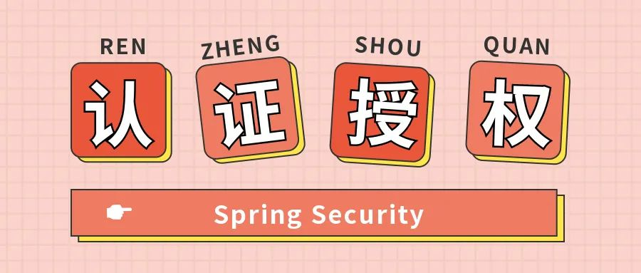


>  以项目驱动学习，以实践检验真知


# 前言

关于认证和授权，R之前已经写了两篇文章：

📖[【项目实践】在用安全框架前，我想先让你手撸一个登陆认证](http://mp.weixin.qq.com/s?__biz=MzkzMjE3NTA3Mg==&mid=2247484720&idx=1&sn=28e0f9ca266016b542a985d7f07dab6d&chksm=c25e88bff52901a91a693ce9f64954a38951a23614e23e633106943d16fc71f39fd7b0f22e16&scene=21#wechat_redirect)

📖[【项目实践】一文带你搞定页面权限、按钮权限以及数据权限](http://mp.weixin.qq.com/s?__biz=MzkzMjE3NTA3Mg==&mid=2247484828&idx=1&sn=c00da8897cd156a28ffa4393752b2404&chksm=c25e8813f52901056709df3002fc745997021518d9553da9b9778597442d206802e49f6dc092&scene=21#wechat_redirect)

在这两篇文章中我们没有使用安全框架就搞定了认证和授权功能，并理解了其核心原理。R在之前就说过，核心原理掌握了，无论什么安全框架使用起来都会非常容易！那么本文就讲解如何使用主流的安全框架Spring Security来实现认证和授权功能。

当然，本文并不只是对框架的使用方法进行讲解，还会剖析Spring Security的源码，看到最后你就会发现你掌握了使用方法的同时，还对框架有了深度的理解！如果没有看过前两篇文章的，强烈建议先看一下，因为安全框架只是帮我们封装了一些东西，背后的原理是不会变的。

本文所有代码都放在了Github上，克隆下来即可运行：

https://github.com/RudeCrab/rude-java

# 提纲挈领

Web系统中登录认证（Authentication）的核心就是**「凭证」**机制，无论是`Session`还是`JWT`，都是在用户成功登录时返回给用户一个凭证，后续用户访问接口需携带凭证来标明自己的身份。后端会对需要进行认证的接口进行安全判断，若凭证没问题则代表已登录就放行接口，若凭证有问题则直接拒绝请求。这个安全判断**「都是放在过滤器里统一处理的」**：

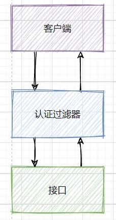

登录认证是对**「用户的身份」**进行确认，权限授权（Authorization）是对**「用户能否访问某个资源」**进行确认，授权发生都认证之后。认证一样，这种通用逻辑都是放在过滤器里进行的统一操作：

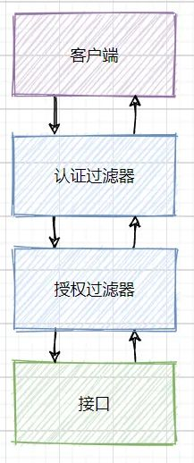

`LoginFilter`先进行登录认证判断，认证通过后再由`AuthFilter`进行权限授权判断，一层一层没问题后才会执行我们真正的业务逻辑。

Spring Security对Web系统的支持**「就是基于这一个个过滤器组成的过滤器链」**：

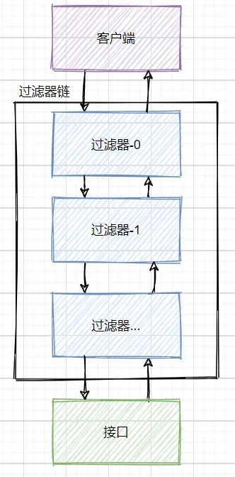

用户请求都会经过`Servlet`的过滤器链，在之前两篇文章中我们就是通过自定义的两个过滤器实现了认证授权功能！而Spring Security也是做的同样的事完成了一系列功能：

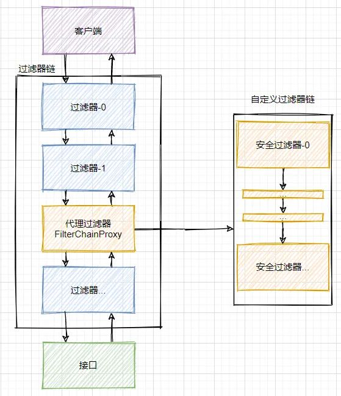

在`Servlet`过滤器链中，Spring Security向其添加了一个`FilterChainProxy`过滤器，这个代理过滤器会创建一套Spring Security自定义的过滤器链，然后执行一系列过滤器。我们可以大概看一下`FilterChainProxy`的大致源码：

```java
@Override
public void doFilter(ServletRequest request, ServletResponse response,
                     FilterChain chain) throws IOException, ServletException {
    ...省略其他代码
    
    // 获取Spring Security的一套过滤器
    List<Filter> filters = getFilters(request);
    // 将这一套过滤器组成Spring Security自己的过滤链，并开始执行
    VirtualFilterChain vfc = new VirtualFilterChain(fwRequest, chain, filters);
    vfc.doFilter(request, response);
    
    ...省略其他代码
}
```

我们可以看一下Spring Security默认会启用多少过滤器：

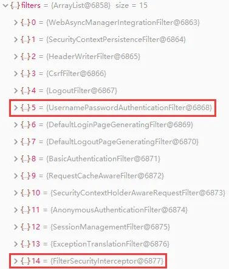

这里面我们只需要重点关注两个过滤器即可：`UsernamePasswordAuthenticationFilter `负责登录认证，`FilterSecurityInterceptor` 负责权限授权。

**「💡Spring Security的核心逻辑全在这一套过滤器中，过滤器里会调用各种组件完成功能，掌握了这些过滤器和组件你就掌握了Spring Security」**！这个框架的使用方式就是对这些过滤器和组件进行扩展。

一定要记住这句话，带着这句话去使用和理解Spring Security，你会像站在高处俯瞰，整个框架的脉络一目了然。

刚才我们总览了一下全局，现在我们就开始进行代码编写了。

要使用Spring Security肯定是要先引入依赖包（Web项目其他必备依赖我在之前文章中已讲解，这里就不过多阐述了）：

```xml
<dependency>
    <groupId>org.springframework.boot</groupId>
    <artifactId>spring-boot-starter-security</artifactId>
</dependency>
```

依赖包导入后，Spring Security就默认提供了许多功能将整个应用给保护了起来：

📝要求经过身份验证的用户才能与应用程序进行交互

📝创建好了默认登录表单

📝生成用户名为`user`的随机密码并打印在控制台上

📝`CSRF`攻击防护、`Session Fixation`攻击防护

📝等等等等......

在实际开发中，这些**「默认配置好的功能往往不符合我们的实际需求，所以我们一般会自定义一些配置」**。配置方式很简单，新建一个配置类即可：

```java
@EnableWebSecurity
public class SecurityConfig extends WebSecurityConfigurerAdapter {
}
```

在该类中重写`WebSecurityConfigurerAdapter`的方法就能对Spring Security进行自定义配置。

# 登录认证

依赖包和配置类准备好后，接下来我们要完成的第一个功能那自然是登录认证，毕竟用户要使用我们系统第一步就是登录。之前文章介绍了`Session`和`JWT`两种认证方式，这里我们来用Spring Security实现这两种认证。

## 最简单的认证方式

不管哪种认证方式和框架，有些核心概念是不会变的，这些核心概念在安全框架中会以各种组件来体现，了解各个组件的同时功能也就跟着实现了功能。

我们系统中会有许多用户，确认当前是哪个用户正在使用我们系统就是登录认证的最终目的。这里我们就提取出了一个核心概念：**「当前登录用户/当前认证用户」**。整个系统安全都是围绕当前登录用户展开的！这个不难理解，要是当前登录用户都不能确认了，那A下了一个订单，下到了B的账户上这不就乱套了。这一概念在Spring Security中的体现就是 **「💡`Authentication`」**，它存储了认证信息，代表当前登录用户。

我们在程序中如何获取并使用它呢？我们需要通过 **「`💡SecurityContext`」** 来获取`Authentication`，看了之前文章的朋友大概就猜到了这个`SecurityContext`就是我们的上下文对象！

> 这种在一个线程中横跨若干方法调用，需要传递的对象，我们通常称之为上下文（Context）。上下文对象是非常有必要的，否则你每个方法都得额外增加一个参数接收对象，实在太麻烦了。

这个上下文对象则是交由 **「💡`SecurityContextHolder`」** 进行管理，你可以在程序**「任何地方」**使用它：

```java
Authentication authentication = SecurityContextHolder.getContext().getAuthentication();
```

可以看到调用链路是这样的：`SecurityContextHolder`👉`SecurityContext`👉`Authentication`。

`SecurityContextHolder`原理非常简单，就是和我们之前实现的上下文对象一样，使用`ThreadLocal`来保证一个线程中传递同一个对象！源码我就不贴了，具体可看之前文章写的上下文对象实现。

现在我们已经知道了Spring Security中三个核心组件：

📝`Authentication`：存储了认证信息，代表当前登录用户

📝`SeucirtyContext`：上下文对象，用来获取`Authentication`

📝`SecurityContextHolder`：上下文管理对象，用来在程序任何地方获取`SecurityContext`

他们关系如下：

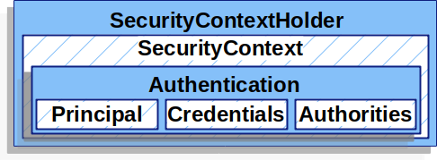

`Authentication`中那三个玩意就是认证信息：

📝`Principal`：用户信息，没有认证时一般是用户名，认证后一般是用户对象

📝`Credentials`：用户凭证，一般是密码

📝`Authorities`：用户权限

现在我们知道如何获取并使用当前登录用户了，那这个用户是怎么进行认证的呢？总不能我随便new一个就代表用户认证完毕了吧。所以我们还缺一个生成`Authentication`对象的认证过程！

认证过程就是登录过程，不使用安全框架时咱们的认证过程是这样的：

查询用户数据👉判断账号密码是否正确👉正确则将用户信息存储到上下文中👉上下文中有了这个对象则代表该用户登录了

Spring Security的认证流程也是如此：

```java
Authentication authentication = new UsernamePasswordAuthenticationToken(用户名, 用户密码, 用户的权限集合);
SecurityContextHolder.getContext().setAuthentication(authentication);
```

和不使用安全框架一样，将认证信息放到上下文中就代表用户已登录。上面代码演示的就是Spring Security最简单的认证方式，直接将`Authentication`放置到`SecurityContext`中就完成认证了！

这个流程和之前获取当前登录用户的流程自然是相反的：`Authentication`👉`SecurityContext`👉`SecurityContextHolder`。

是不是觉得，就这？这就完成认证啦？这也太简单了吧。对于Spring Security来说，这样确实就完成了认证，但对于我们来说还少了一步，那就是判断用户的账号密码是否正确。用户进行登录操作时会传递过来账号密码，我们肯定是要查询用户数据然后判断传递过来的账号密码是否正确，只有正确了咱们才会将认证信息放到上下文对象中，不正确就直接提示错误：

```java
// 调用service层执行判断业务逻辑
if (!userService.login(用户名, 用户密码)) {
    return "账号密码错误";
}
// 账号密码正确了才将认证信息放到上下文中（用户权限需要再从数据库中获取，后面再说，这里省略）
Authentication authentication = new UsernamePasswordAuthenticationToken(用户名, 用户密码, 用户的权限集合);
SecurityContextHolder.getContext().setAuthentication(authentication);
```

这样才算是一个完整的认证过程，和不使用安全框架时的流程是一样的哦，只是一些组件之前是我们自己实现的。

这里查询用户信息并校验账号密码是完全由我们自己在业务层编写所有逻辑，其实这一块Spring Security也有组件供我们使用：

##  AuthenticationManager认证方式

**「💡`AuthenticationManager`」** 就是Spring Security用于执行身份验证的组件，只需要调用它的`authenticate`方法即可完成认证。Spring Security默认的认证方式就是在`UsernamePasswordAuthenticationFilter`这个过滤器中调用这个组件，该过滤器负责认证逻辑。

我们要按照自己的方式使用这个组件，先在之前配置类配置一下：

```java
@EnableWebSecurity
public class SecurityConfig extends WebSecurityConfigurerAdapter {
    @Bean
    @Override
    protected AuthenticationManager authenticationManager() throws Exception {
        return super.authenticationManager();
    }
}
```

这里我们写上完整的登录接口代码：

```java
@RestController
@RequestMapping("/API")
public class LoginController {
    @Autowired
    private AuthenticationManager authenticationManager;

    @PostMapping("/login")
    public String login(@RequestBody LoginParam param) {
        // 生成一个包含账号密码的认证信息
        Authentication token = new UsernamePasswordAuthenticationToken(param.getUsername(), param.getPassword());
        // AuthenticationManager校验这个认证信息，返回一个已认证的Authentication
        Authentication authentication = authenticationManager.authenticate(token);
        // 将返回的Authentication存到上下文中
        SecurityContextHolder.getContext().setAuthentication(authentication);
        return "登录成功";
    }
}
```

> 注意，这里流程和之前说的流程是完全一样的，只是用户身份验证改成了使用`AuthenticationManager`来进行。

`AuthenticationManager`的校验逻辑非常简单：

根据用户名先查询出用户对象(没有查到则抛出异常)👉将用户对象的密码和传递过来的密码进行校验，密码不匹配则抛出异常

这个逻辑没啥好说的，再简单不过了。重点是这里每一个步骤Spring Security都提供了组件：

📝是谁执行 **「根据用户名查询出用户对象」** 逻辑的呢？用户对象数据可以存在内存中、文件中、数据库中，你得确定好怎么查才行。这一部分就是交由**「💡`UserDetialsService`」** 处理，该接口只有一个方法`loadUserByUsername(String username)`，通过用户名查询用户对象，默认实现是在内存中查询。

📝那查询出来的 **「用户对象」** 又是什么呢？每个系统中的用户对象数据都不尽相同，咱们需要确认我们的用户数据是啥样的才行。Spring Security中的用户数据则是由**「💡`UserDetails`」** 来体现，该接口中提供了账号、密码等通用属性。

📝**「对密码进行校验」**大家可能会觉得比较简单，`if、else`搞定，就没必要用什么组件了吧？但框架毕竟是框架考虑的比较周全，除了`if、else`外还解决了密码加密的问题，这个组件就是**「💡`PasswordEncoder`」**，负责密码加密与校验。

我们可以看下`AuthenticationManager`校验逻辑的大概源码：

```java
public Authentication authenticate(Authentication authentication) throws AuthenticationException {
    ...省略其他代码
    
    // 传递过来的用户名
    String username = authentication.getName();
    // 调用UserDetailService的方法，通过用户名查询出用户对象UserDetail（查询不出来UserDetailService则会抛出异常）
    UserDetails userDetails = this.getUserDetailsService().loadUserByUsername(username);
    String presentedPassword = authentication.getCredentials().toString();
 
    // 传递过来的密码
    String password = authentication.getCredentials().toString();
    // 使用密码解析器PasswordEncoder传递过来的密码是否和真实的用户密码匹配
    if (!passwordEncoder.matches(password, userDetails.getPassword())) {
        // 密码错误则抛出异常
        throw new BadCredentialsException("错误信息...");
    }
    
    // 注意哦，这里返回的已认证Authentication，是将整个UserDetails放进去充当Principal
    UsernamePasswordAuthenticationToken result = new UsernamePasswordAuthenticationToken(userDetails,
    authentication.getCredentials(), userDetails.getAuthorities());
 return result;
    
    ...省略其他代码
}
```

`UserDetialsService`👉`UserDetails`👉`PasswordEncoder`，这三个组件Spring Security都有默认实现，这一般是满足不了我们的实际需求的，所以这里我们自己来实现这些组件！

### 加密器PasswordEncoder

首先是`PasswordEncoder`，这个接口很简单就两个重要方法：

```java
public interface PasswordEncoder {
    /**
   * 加密
   */
    String encode(CharSequence rawPassword);
    /**
   * 将未加密的字符串（前端传递过来的密码）和已加密的字符串（数据库中存储的密码）进行校验
   */
    boolean matches(CharSequence rawPassword, String encodedPassword);
}
```

你可以实现此接口定义自己的加密规则和校验规则，不过Spring Security提供了很多加密器实现，我们这里选定一个就好。可以在之前所说的**「配置类」**里进行如下配置：

```java
@Bean
public PasswordEncoder(){
    // 这里我们使用bcrypt加密算法，安全性比较高
    return new BCryptPasswordEncoder();
}
```

因为密码加密是我前面文章少数没有介绍的功能，所以这里额外提一嘴。往数据库中添加用户数据时就要将密码进行加密，否则后续进行密码校验时从数据库拿出来的还是明文密码，是无法通过校验的。比如我们有一个用户注册的接口：

```java
@Autowired
private PasswordEncoder passwordEncoder;

@PostMapping("/register")
public String register(@RequestBody UserParam param) {
    UserEntity user = new UserEntity();
    // 调用加密器将前端传递过来的密码进行加密
    user.setUsername(param.getUsername()).setPassword(passwordEncoder.encode(param.getPassword()));
    // 将用户实体对象添加到数据库
    userService.save(user);
    return "注册成功";
}
```

这样数据库中存储的密码都是已加密的了：

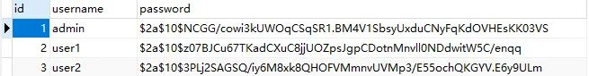

###  用户对象UserDetails

该接口就是我们所说的用户对象，它提供了用户的一些通用属性：

```java
public interface UserDetails extends Serializable {
   /**
    * 用户权限集合（这个权限对象现在不管它，到权限时我会讲解）
    */
   Collection<? extends GrantedAuthority> getAuthorities();
   /**
    * 用户密码
    */
   String getPassword();
   /**
    * 用户名
    */
   String getUsername();
   /**
    * 用户没过期返回true，反之则false
    */
   boolean isAccountNonExpired();
   /**
    * 用户没锁定返回true，反之则false
    */
   boolean isAccountNonLocked();
   /**
    * 用户凭据(通常为密码)没过期返回true，反之则false
    */
   boolean isCredentialsNonExpired();
   /**
    * 用户是启用状态返回true，反之则false
    */
   boolean isEnabled();
}
```

实际开发中我们的用户属性各种各样，这些默认属性必然是满足不了，所以我们一般会自己实现该接口，然后设置好我们实际的用户实体对象。实现此接口要重写很多方法比较麻烦，我们可以继承Spring Security提供的`org.springframework.security.core.userdetails.User`类，该类实现了`UserDetails`接口帮我们省去了重写方法的工作：

```java
public class UserDetail extends User {
    /**
     * 我们自己的用户实体对象，要调取用户信息时直接获取这个实体对象。（这里我就不写get/set方法了）
     */
    private UserEntity userEntity;

    public UserDetail(UserEntity userEntity, Collection<? extends GrantedAuthority> authorities) {
        // 必须调用父类的构造方法，以初始化用户名、密码、权限
        super(userEntity.getUsername(), userEntity.getPassword(), authorities);
        this.userEntity = userEntity;
    }
}
```

###  业务对象UserDetailsService

该接口很简单只有一个方法：

```java
public interface UserDetailsService {
 /**
  * 根据用户名获取用户对象（获取不到直接抛异常）
  */
 UserDetails loadUserByUsername(String username) throws UsernameNotFoundException;
```

咱们自己的用户业务类该接口即可完成自己的逻辑：

```java
@Service
public class UserServiceImpl implements UserService, UserDetailsService {
    @Autowired
    private UserMapper userMapper;

    @Override
    public UserDetails loadUserByUsername(String username) {
        // 从数据库中查询出用户实体对象
        UserEntity user = userMapper.selectByUsername(username);
        // 若没查询到一定要抛出该异常，这样才能被Spring Security的错误处理器处理
        if (user == null) {
            throw new UsernameNotFoundException("没有找到该用户");
        }
        // 走到这代表查询到了实体对象，那就返回我们自定义的UserDetail对象（这里权限暂时放个空集合，后面我会讲解）
        return new UserDetail(user, Collections.emptyList());
    }
}
```

`AuthenticationManager`校验所调用的三个组件我们就已经做好实现了！

不知道大家注意到没有，当我们查询用户失败时或者校验密码失败时都会抛出Spring Security的自定义异常。这些异常不可能放任不管，Spring Security对于这些异常都是在`ExceptionTranslationFilter`过滤器中进行处理（可以回顾一下前面的过滤器截图），而**「💡`AuthenticationEntryPoint`」** 则专门处理认证异常！

### 认证异常处理器AuthenticationEntryPoint

该接口也只有一个方法：

```java
public interface AuthenticationEntryPoint {
 /**
  * 接收异常并处理
  */
 void commence(HttpServletRequest request, HttpServletResponse response, AuthenticationException authException);
}
```

我们来自定义一个类实现我们自己的错误处理逻辑：

```java
public class MyEntryPoint implements AuthenticationEntryPoint {
    @Override
    public void commence(HttpServletRequest request, HttpServletResponse response, AuthenticationException e) throws IOException {
        response.setContentType("application/json;charset=utf-8");
        PrintWriter out = response.getWriter();
        // 直接提示前端认证错误
        out.write("认证错误");
        out.flush();
        out.close();
    }
}
```

用户传递过来账号密码👉认证校验👉异常处理，这一整套流程的组件我们就都给定义完了！现在只差最后一步，就是在Spring Security配置类里面进行一些配置，才能让这些生效。

### 配置

Spring Security对哪些接口进行保护、什么组件生效、某些功能是否启用等等都需要在配置类中进行配置，注意看代码注释：

```java
@EnableWebSecurity
public class SecurityConfig extends WebSecurityConfigurerAdapter {
    @Autowired
    private UserServiceImpl userDetailsService;

    @Override
    protected void configure(HttpSecurity http) throws Exception {
        // 关闭csrf和frameOptions，如果不关闭会影响前端请求接口（这里不展开细讲了，感兴趣的自行了解）
        http.csrf().disable();
        http.headers().frameOptions().disable();
        // 开启跨域以便前端调用接口
        http.cors();

        // 这是配置的关键，决定哪些接口开启防护，哪些接口绕过防护
        http.authorizeRequests()
             // 注意这里，是允许前端跨域联调的一个必要配置
                .requestMatchers(CorsUtils::isPreFlightRequest).permitAll()
                // 指定某些接口不需要通过验证即可访问。登陆、注册接口肯定是不需要认证的
                .antMatchers("/API/login", "/API/register").permitAll()
                // 这里意思是其它所有接口需要认证才能访问
                .anyRequest().authenticated()
                // 指定认证错误处理器
                .and().exceptionHandling().authenticationEntryPoint(new MyEntryPoint());
    }

    @Override
    protected void configure(AuthenticationManagerBuilder auth) throws Exception {
        // 指定UserDetailService和加密器
        auth.userDetailsService(userDetailsService).passwordEncoder(passwordEncoder());
    }

    @Bean
    @Override
    protected AuthenticationManager authenticationManager() throws Exception {
        return super.authenticationManager();
    }

    @Bean
    public PasswordEncoder passwordEncoder() {
        return new BCryptPasswordEncoder();
    }
}
```

其中用的最多的就是`configure(HttpSecurity http)`方法，可以通过`HttpSecurity`进行许多配置。当我们重写这个方法时，就已经关闭了默认的表单登录方式，然后我们再配置好启用哪些组件、指定哪些接口需要认证，就搞定了！

假设现在我们有一个`/API/test`接口，在没有登录的时候调用该接口看下效果：

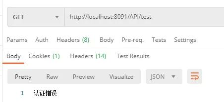

我们登录一下：

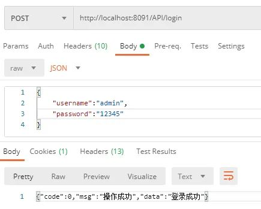

然后再调用测试接口：

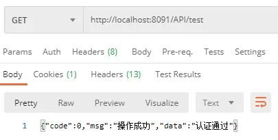

可以看到未登录时测试接口是无法正常访问的，会按照我们在`EntryPoint`中的逻辑返回错误提示。

### 总结和补充

有人可能会问，用`AuthenticationManager`认证方式要配置好多东西啊，我就用之前说的那种最简单的方式不行吗？当然是可以的啦，用哪种方式都随便，只要完成功能都行。其实不管哪种方式我们的认证的逻辑代码一样都没少，只不过一个是我们自己业务类全部搞定，一个是可以集成框架的组件。这里也顺带再总结一下流程：

1. 用户进行登录操作，传递账号密码过来👉登录接口调用`AuthenticationManager`
2. 根据用户名查询出用户数据👉`UserDetailService`查询出`UserDetails`
3. 将传递过来的密码和数据库中的密码进行对比校验👉`PasswordEncoder`
4. 校验通过则将认证信息存入到上下文中👉将`UserDetails`存入到`Authentication`，将`Authentication`存入到`SecurityContext`
5. 如果认证失败则抛出异常👉由`AuthenticationEntryPoint`处理

刚才我们讲的认证方式都是基于`session`机制，认证后Spring Security会将`Authentication`存入到`session`中，Key为`HttpSessionSecurityContextRepository.SPRING_SECURITY_CONTEXT_KEY`。也就是说，你完全可以通过如下方式获取`Authentication`：

```java
Authentication = (Authentication)session.getAttribute(HttpSessionSecurityContextRepository.SPRING_SECURITY_CONTEXT_KEY)
```

当然，官方还是不推荐这样直接操作的，因为统一通过`SecurityContextHolder`操作更利于管理！使用`SecurityContextHolder`除了获取当前用户外，退出登录的操作也是很方便的：

```java
@GetMapping("/logout")
public String logout() {
    SecurityContextHolder.clearContext();
    return "退出成功";
}
```

`session`认证咱们就讲解到此，接下来咱们讲解`JWT`的认证。

## JWT集成

关于`JWT`的介绍和工具类等我在前面文章已经讲的很清楚了，这里我就不额外说明了，直接带大家实现代码。

采用`JWT`的方式进行认证首先做的第一步就是在配置类里禁用掉`session`：

```java
// 禁用session
http.sessionManagement().sessionCreationPolicy(SessionCreationPolicy.STATELESS);
```

> 注意，这里的禁用是指Spring Security不采用`session`机制了，不代表你禁用掉了整个系统的`session`功能。

然后我们再修改一下登录接口，当用户登录成功的同时，我们需要生成`token`并返回给前端，这样前端才能访问其他接口时携带`token`：

```java
@Autowired
private UserService userService;

@PostMapping("/login")
public UserVO login(@RequestBody @Validated LoginParam user) {
    // 调用业务层执行登录操作
    return userService.login(user);
}
```

业务层方法：

```java
public UserVO login(LoginParam param) {
    // 根据用户名查询出用户实体对象
    UserEntity user = userMapper.selectByUsername(param.getUsername());
    // 若没有查到用户 或者 密码校验失败则抛出自定义异常
    if (user == null || !passwordEncoder.matches(param.getPassword(), user.getPassword())) {
        throw new ApiException("账号密码错误");
    }

    // 需要返回给前端的VO对象
    UserVO userVO = new UserVO();
    userVO.setId(user.getId())
        .setUsername(user.getUsername())
        // 生成JWT，将用户名数据存入其中
        .setToken(jwtManager.generate(user.getUsername()));
    return userVO;
}
```

我们执行一下登录操作：

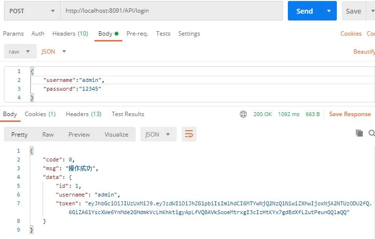

我们可以看到登录成功时接口会返回`token`，后续我们再访问其它接口时需要将`token`放到请求头中。这里我们需要自定义一个认证过滤器，来对`token`进行校验：

```java
@Component
public class LoginFilter extends OncePerRequestFilter {
    @Autowired
    private JwtManager jwtManager;
    @Autowired
    private UserServiceImpl userService;

    @Override
    protected void doFilterInternal(HttpServletRequest request, HttpServletResponse response, FilterChain chain) throws ServletException, IOException {
        // 从请求头中获取token字符串并解析（JwtManager之前文章有详解，这里不多说了）
        Claims claims = jwtManager.parse(request.getHeader("Authorization"));
        if (claims != null) {
            // 从`JWT`中提取出之前存储好的用户名
            String username = claims.getSubject();
            // 查询出用户对象
            UserDetails user = userService.loadUserByUsername(username);
            // 手动组装一个认证对象
            Authentication authentication = new UsernamePasswordAuthenticationToken(user, user.getPassword(), user.getAuthorities());
            // 将认证对象放到上下文中
            SecurityContextHolder.getContext().setAuthentication(authentication);
        }
        chain.doFilter(request, response);
    }
}
```

过滤器中的逻辑和之前介绍的**「最简单的认证方式」**逻辑是一致的，每当一个请求来时我们都会校验`JWT`进行认证，上下文对象中有了`Authentication`后续过滤器就会知道该请求已经认证过了。

咱们这个自定义的过滤器需要替换掉Spring Security默认的认证过滤器，这样我们的过滤器才能生效，所以我们需要进行如下配置：

```java
// 将我们自定义的认证过滤器替换掉默认的认证过滤器
http.addFilterBefore(loginFilter, UsernamePasswordAuthenticationFilter.class);
```

我们可以断点调试看一下现在的过滤器是怎样的：

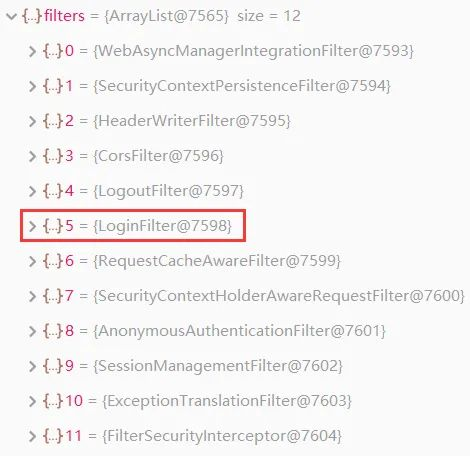

可以看到我们自定义的过滤器已经替换掉了`UsernamePasswordAuthenticationFilter`默认过滤器了！当我们携带`token`访问接口时可以发现已经生效：


登录认证到此就讲解完毕了，接下来我们一鼓作气来实现权限授权！

# 权限授权

菜单权限主要是通过前端渲染，数据权限主要靠`SQL`拦截，和Spring Security没太大耦合，就不多展开了。我们来梳理一下**「接口权限」**的授权的流程：

1. 当一个请求过来，我们先得知道这个请求的规则，即需要怎样的权限才能访问
2. 然后获取当前登录用户所拥有的权限
3. 再校验当前用户是否拥有该请求的权限
4. 用户拥有这个权限则正常返回数据，没有权限则拒绝请求

完成了登录认证功能后，想必大家已经有点感觉：Spring Security将流程功能分得很细，每一个小功能都会有一个组件专门去做，我们要做的就是去自定义这些组件！Spring Security针对上述流程也提供了许多组件。

Spring Security的授权发生在`FilterSecurityInterceptor`过滤器中：

1. 首先调用的是**「💡`SecurityMetadataSource`」**，来获取当前请求的鉴权规则
2. 然后通过`Authentication`获取当前登录用户所有权限数据：**「💡`GrantedAuthority`」**，这个我们前面提过，认证对象里存放这个权限数据
3. 再调用**「💡`AccessDecisionManager`」** 来校验当前用户是否拥有该权限
4. 如果有就放行接口，没有则抛出异常，该异常会被**「💡`AccessDeniedHandler`」** 处理

我们可以来看一下过滤器里大概的源码：

```java
public void doFilter(ServletRequest request, ServletResponse response, FilterChain chain) throws IOException, ServletException {
    ...省略其它代码
        
    // 这是Spring Security封装的对象，该对象里包含了request等信息
    FilterInvocation fi = new FilterInvocation(request, response, chain);
    // 这里调用了父类的AbstractSecurityInterceptor的方法,认证核心逻辑基本全在父类里
    InterceptorStatusToken token = super.beforeInvocation(fi);

    ...省略其它代码
}
```

父类的`beforeInvocation`大概源码如下：

```java
protected InterceptorStatusToken beforeInvocation(Object object) {
    ...省略其它代码
    
    // 调用SecurityMetadataSource来获取当前请求的鉴权规则，这个ConfigAttribue就是规则，后面我会讲
    Collection<ConfigAttribute> attributes = this.obtainSecurityMetadataSource().getAttributes(object);
    // 如果当前请求啥规则也没有，就代表该请求无需授权即可访问，直接结束方法
    if (CollectionUtils.isEmpty(attributes)) {
        return null;
    }
    
    // 获取当前登录用户
    Authentication authenticated = authenticateIfRequired();
    // 调用AccessDecisionManager来校验当前用户是否拥有该权限，没有权限则抛出异常
    this.accessDecisionManager.decide(authenticated, object, attributes);
    
    ...省略其它代码
}
```

老生常谈，核心流程都是一样的。我们接下来自定义这些组件，以完成我们自己的鉴权逻辑。

## 鉴权规则源SecurityMetadataSource

该接口我们只需要关注一个方法：

```java
public interface SecurityMetadataSource {
 /**
  * 获取当前请求的鉴权规则
  
  * @param object 该参数就是Spring Security封装的FilterInvocation对象，包含了很多request信息
  * @return 鉴权规则对象
  */
 Collection<ConfigAttribute> getAttributes(Object object);

}
```

`ConfigAttribute`就是我们所说的鉴权规则，该接口只有一个方法：

```java
public interface ConfigAttribute {
 /**
  * 这个字符串就是规则，它可以是角色名、权限名、表达式等等。
  * 你完全可以按照自己想法来定义，后面AccessDecisionManager会用这个字符串
  */
 String getAttribute();
}
```

在之前文章中我们授权的实现全是靠着资源`id`，用户`id`关联角色`id`，角色`id`关联资源`id`，这样用户就相当于关联了资源，而我们接口资源在数据库中的体现是这样的：

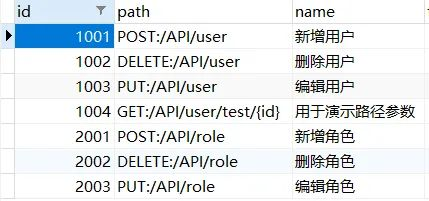

这里还是一样，我们照样以资源`id`作为权限的标记。接下咱们就来自定义`SecurityMetadataSource`组件：

```java
@Component
public class MySecurityMetadataSource implements SecurityMetadataSource {
    /**
     * 当前系统所有接口资源对象，放在这里相当于一个缓存的功能。
     * 你可以在应用启动时将该缓存给初始化，也可以在使用过程中加载数据，这里我就不多展开说明了
     */
    private static final Set<Resource> RESOURCES = new HashSet<>();

    @Override
    public Collection<ConfigAttribute> getAttributes(Object object) {
        // 该对象是Spring Security帮我们封装好的，可以通过该对象获取request等信息
        FilterInvocation filterInvocation = (FilterInvocation) object;
        HttpServletRequest request = filterInvocation.getRequest();
        // 遍历所有权限资源，以和当前请求进行匹配
        for (Resource resource : RESOURCES) {
            // 因为我们url资源是这种格式：GET:/API/user/test/{id}，冒号前面是请求方法，冒号后面是请求路径，所以要字符串拆分
            String[] split = resource.getPath().split(":");
            // 因为/API/user/test/{id}这种路径参数不能直接equals来判断请求路径是否匹配，所以需要用Ant类来匹配
            AntPathRequestMatcher ant = new AntPathRequestMatcher(split[1]);
            // 如果请求方法和请求路径都匹配上了，则代表找到了这个请求所需的权限资源
            if (request.getMethod().equals(split[0]) && ant.matches(request)) {
                // 将我们权限资源id返回，这个SecurityConfig就是ConfigAttribute一个简单实现
                return Collections.singletonList(new SecurityConfig(resource.getId().toString()));
            }
        }
        // 走到这里就代表该请求无需授权即可访问，返回空
        return null;
    }

    @Override
    public Collection<ConfigAttribute> getAllConfigAttributes() {
        // 不用管，这么写就行
        return null;
    }

    @Override
    public boolean supports(Class<?> clazz) {
        // 不用管，这么写就行
        return true;
    }
}
```

注意，我们这里返回的`ConfigAttribute`鉴权规则，就是我们的资源`id`。

##  用户权限GrantedAuthority

该组件代表用户所拥有的权限，和`ConfigAttribute`一样也只有一个方法，该方法返回的字符串就是代表着权限

```java
public interface GrantedAuthority extends Serializable {
 String getAuthority();
}
```

将`GrantedAuthority`和`ConfigAttribute`一对比，就知道用户是否拥有某个权限了。

Spring Security对`GrantedAuthority`有一个简单实现`SimpleGrantedAuthority`，对咱们来说够用了，所以我们额外再新建一个实现。我们要做的就是在`UserDetialsService`中，获取用户对象的同时也将权限数据查询出来：

```java
@Override
public UserDetails loadUserByUsername(String username) {
    UserEntity user = userMapper.selectByUsername(username);
    if (user == null) {
        throw new UsernameNotFoundException("没有找到该用户");
    }
    // 先将该用户所拥有的资源id全部查询出来，再转换成`SimpleGrantedAuthority`权限对象
    Set<SimpleGrantedAuthority> authorities = resourceService.getIdsByUserId(user.getId())
        .stream()
        .map(String::valueOf)
        .map(SimpleGrantedAuthority::new)
        .collect(Collectors.toSet());
    // 将用户实体和权限集合都放到UserDetail中，
    return new UserDetail(user, authorities);
}
```

这样当认证完毕时，`Authentication`就会拥有用户信息和权限数据了。

## 授权管理AccessDecisionManager

终于要来到我们真正的授权组件了，这个组件才最终决定了你有没有某个权限，该接口我们只需关注一个方法：

```java
public interface AccessDecisionManager {

 /**
  * 授权操作，如果没有权限则抛出异常 
  *
     * @param authentication 当前登录用户，以获取当前用户权限信息
  * @param object FilterInvocation对象，以获取request信息
  * @param configAttributes 当前请求鉴权规则
  */
 void decide(Authentication authentication, Object object, Collection<ConfigAttribute> configAttributes)
   throws AccessDeniedException, InsufficientAuthenticationException;
}
```

该方法接受了这几个参数后完全能做到权限校验了，我们来实现自己的逻辑：

```java
@Component
public class MyDecisionManager implements AccessDecisionManager {
    @Override
    public void decide(Authentication authentication, Object object, Collection<ConfigAttribute> configAttributes) {
        // 如果授权规则为空则代表此URL无需授权就能访问
        if (Collections.isEmpty(configAttributes)) {
            return;
        }
        // 判断授权规则和当前用户所属权限是否匹配
        for (ConfigAttribute ca : configAttributes) {
            for (GrantedAuthority authority : authentication.getAuthorities()) {
                // 如果匹配上了，代表当前登录用户是有该权限的，直接结束方法
                if (Objects.equals(authority.getAuthority(), ca.getAttribute())) {
                    return;
                }
            }
        }
        // 走到这里就代表没有权限，必须要抛出异常，否则错误处理器捕捉不到
        throw new AccessDeniedException("没有相关权限");
    }

    @Override
    public boolean supports(ConfigAttribute attribute) {
        // 不用管，这么写就行
        return true;
    }

    @Override
    public boolean supports(Class<?> clazz) {
        // 不用管，这么写就行
        return true;
    }
}
```

## 授权错误处理器AccessDeniedHandler

该组件和之前的认证异常处理器一样，只有一个方法用来处理异常，只不过这个是用来处理授权异常的。我们直接来实现：

```java
public class MyDeniedHandler implements AccessDeniedHandler {
    @Override
    public void handle(HttpServletRequest request, HttpServletResponse response, AccessDeniedException accessDeniedException) throws IOException, ServletException {
        response.setContentType("application/json;charset=utf-8");
        out.write("没有相关权限");
        out.flush();
        out.close();
    }
}
```

## 配置

组件都定义好了，那我们接下来就是最后一步咯，就是让这些组件生效。我们的鉴权规则源组件`SecurityMetadataSource`和授权管理组件`AccessDecisionManager`必须通过授权过滤器`FilterSecurityInterceptor`来配置生效，所以我们得自己先写一个过滤器，这个过滤器的核心代码基本按照父类的写就行，主要就是属性的配置：

```java
@Component
public class AuthFilter extends AbstractSecurityInterceptor implements Filter {
    @Autowired
    private SecurityMetadataSource securityMetadataSource;

    @Override
    public SecurityMetadataSource obtainSecurityMetadataSource() {
        // 将我们自定义的SecurityMetadataSource给返回
        return this.securityMetadataSource;
    }

    @Override
    @Autowired
    public void setAccessDecisionManager(AccessDecisionManager accessDecisionManager) {
        // 将我们自定义的AccessDecisionManager给注入
        super.setAccessDecisionManager(accessDecisionManager);
    }

    @Override
    public void doFilter(ServletRequest request, ServletResponse response, FilterChain chain) throws IOException, ServletException {
        // 下面的就是按照父类写法写的
        FilterInvocation fi = new FilterInvocation(request, response, chain);
        InterceptorStatusToken token = super.beforeInvocation(fi);
        try {
            // 执行下一个拦截器
            fi.getChain().doFilter(fi.getRequest(), fi.getResponse());
        }  finally {
            // 请求之后的处理
            super.afterInvocation(token, null);
        }
    }

    @Override
    public Class<?> getSecureObjectClass() {
        return FilterInvocation.class;
    }

    @Override
    public void init(FilterConfig filterConfig) {}

    @Override
    public void destroy() {}
}
```

过滤器定义好了，我们回到Spring Security配置类让这个过滤器替换掉原有的过滤器就一切都搞定啦：

```java
http.addFilterBefore(authFilter, FilterSecurityInterceptor.class);
```

我们可以来看下效果，没有权限的情况下访问接口：

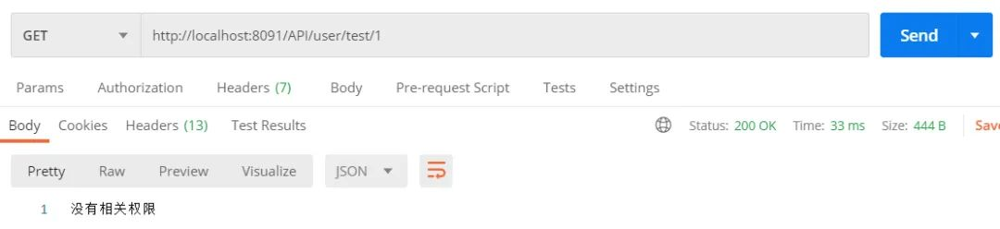

有权限的情况下访问接口：

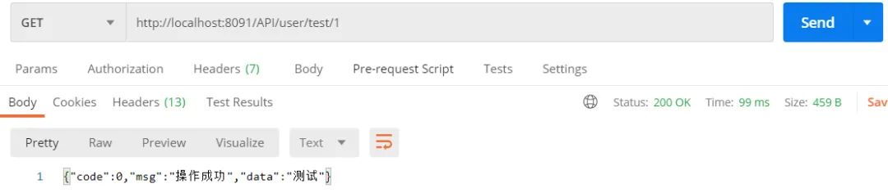

# 总结

整个Spring Security就讲解完毕了，我们对两个过滤器、N多个组件进行了自定义实现，从而达到了我们的功能。这里做了一个思维导图方便大家理解：

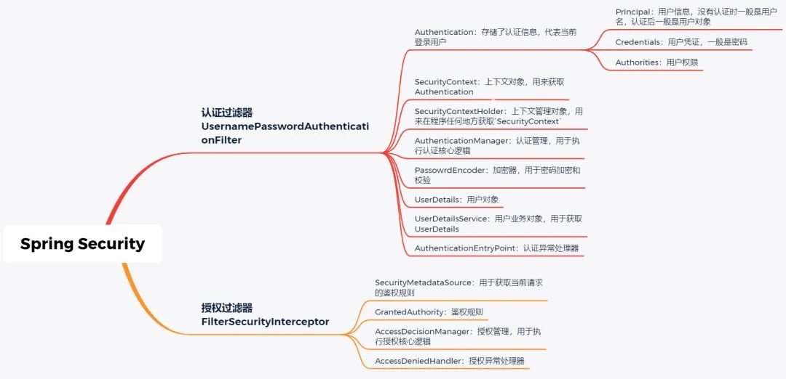

别看组件这么多，认证授权的核心流程和一些概念是不会变的，什么安全框架都万变不离其宗。比如`Shiro`，其中最基本的概念`Subject`就代表当前用户，`SubjectManager`就是用户管理器……

在我前两篇文章中有人也谈到用安全框架还不如自己手写，确实，手写可以最大灵活度按照自己的想法来（并且也不复杂），使用安全框架反而要配合框架的定式，好像被束缚了。那安全框架对比手写有什么优势呢？我觉得优势主要有如下两点：

1. 一些功能开箱即用，比如Spring Security的加密器，非常方便
2. 框架的定式既是束缚也是规范，无论谁接手你的项目，一看到熟悉的安全框架就能立马上手

讲解到这里就结束了，本文所有代码、`SQL`语句都放在Github克隆下来即可运行：

https://github.com/RudeCrab/rude-java