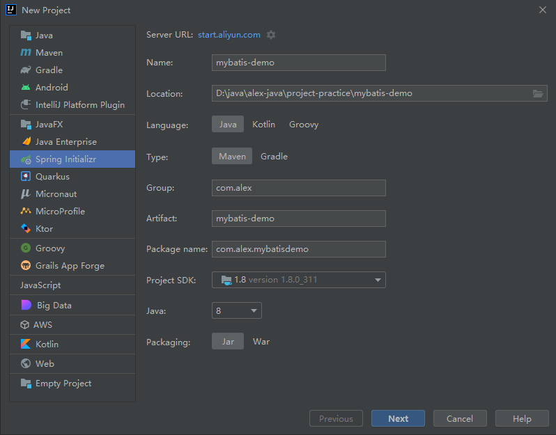

# Spring Boot 整合 MyBatis

> 环境
>
> SpringBoot: 2.7.6
>
> mybatis-spring-boot-starter: 2.2.2
>
> mysql: 5.7.26


💖步骤：

1. 应用相关的包：spring-boot-starter、spring-boot-starter-jdbc、mysql-connect-java、mybatis-spring-boot-starter
2. 数据源配置
3. 业务代码：entity，mapper，mapper.xml，service，service.impl，controller
4. 添加 `@MapperScan`注解，扫描数据访问接口所在包
5. MyBatis配置文件位置
6. 单元测试：junit5


Download pre-built shared indexes for JDK and Maven libraries

参考：[#IntelliJ IDEA#pre-built shared indexes_哔哩哔哩_bilibili](https://www.bilibili.com/video/av889664431/)

💥 问题： com.mysql.cj.jdbc.Driver 与 com.mysql.jdbc.Driver 区别
参考：https://blog.csdn.net/a907691592/article/details/96876030

本质区别：

com.mysql.jdbc.Driver 是 mysql-connector-java 5 中的，

com.mysql.cj.jdbc.Driver 是 mysql-connector-java 6以及以上中的

在使用 com.mysql.jdbc.Driver时，配置是：

```properties
driverClassName=com.mysql.jdbc.Driver
url=jdbc:mysql://localhost:3306/test?useUnicode=true&characterEncoding=utf8&useSSL=false
username=root
password=
```

在使用 com.mysql.cj.jdbc.Driver时，则是需要下面这样的配置：

```
driverClassName=com.mysql.cj.jdbc.Driver
url=jdbc:mysql://localhost:3306/test?useUnicode=true&characterEncoding=utf-8&serverTimezone=Asia/Shanghai
username=root
password=
```

如果使用 com.mysql.jdbc.Driver 时，运行时，控制台会有以下警告，解决方法就是切换到com.mysql.cj.jdbc.Driver

```
Loading class `com.mysql.jdbc.Driver'. This is deprecated. The new driver class is `com.mysql.cj.jdbc.Driver'. The driver is automatically registered via the SPI and manual loading of the driver class is generally unnecessary.
```

👏使用 com.mysql.cj.jdbc.Driver，在设置url时，注意设置为中国时区，否则会差8个小时

```
spring.datasource.url=jdbc:mysql://localhost:3306/shop?useUnicode=true&characterEncoding=utf-8&serverTimezone=Asia/Shanghai
```

测试数据库表
```sql
SET NAMES utf8mb4;
SET FOREIGN_KEY_CHECKS = 0;

-- ----------------------------
-- Table structure for goods
-- ----------------------------
DROP TABLE IF EXISTS `goods`;
CREATE TABLE `goods`  (
  `id` bigint(20) NOT NULL AUTO_INCREMENT,
  `name` varchar(255) CHARACTER SET utf8 COLLATE utf8_general_ci NULL DEFAULT NULL,
  `pic` varchar(255) CHARACTER SET utf8 COLLATE utf8_general_ci NULL DEFAULT NULL,
  `price` varchar(255) CHARACTER SET utf8 COLLATE utf8_general_ci NULL DEFAULT NULL,
  `create_time` datetime(0) NULL DEFAULT NULL,
  PRIMARY KEY (`id`) USING BTREE
) ENGINE = InnoDB AUTO_INCREMENT = 6 CHARACTER SET = utf8 COLLATE = utf8_general_ci ROW_FORMAT = Dynamic;

SET FOREIGN_KEY_CHECKS = 1;
```


## 1. 使用 Spring Initializr 创建项目

Spring Boot 版本选择 2.7.6

